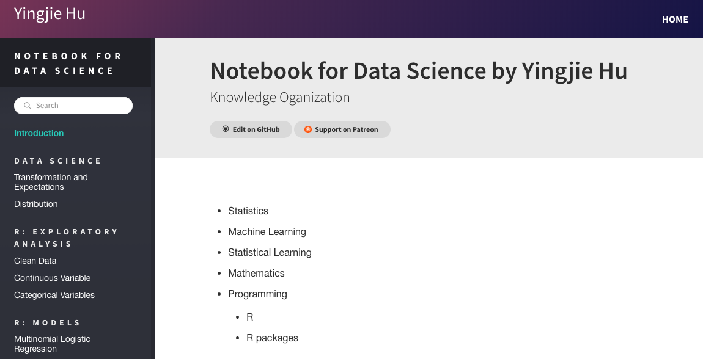
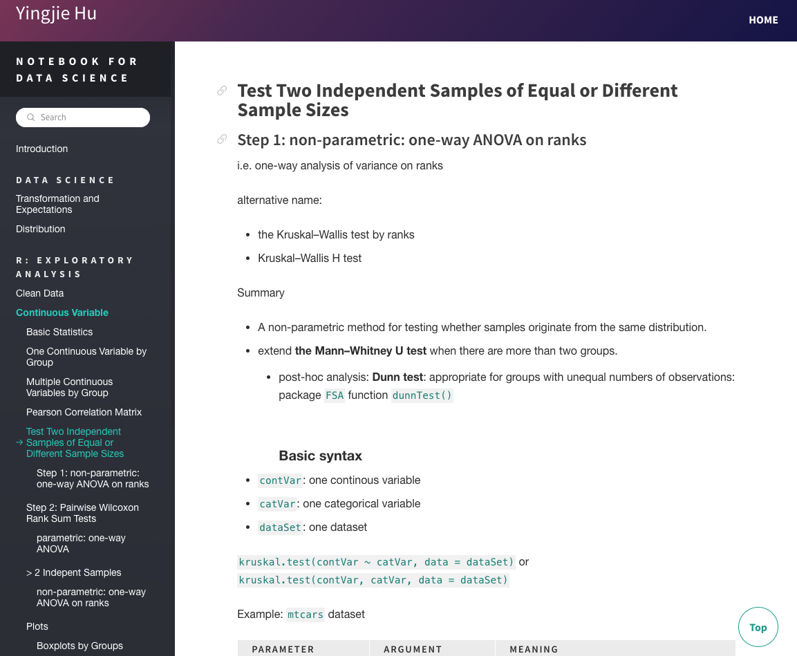

<h1 align="center"> Yingjie Hu's Notebook </h1>

📝 💻 Notes for knowledge learned for Data Science, Maths, Statistics, and Machine Learning ✔︎✔︎

	<a href="http://notebook.yingjiehu.com/">Website</a>&nbsp;&nbsp;&nbsp;
	<a href="https://www.patreon.com/yingjie" target="_blank">Donation</a>&nbsp;&nbsp;&nbsp;
	<a href="https://www.patreon.com/yingjie" target="_blank">Become a Sponsor</a>

	Created and Maintained By <a href="http://yingjiehu.com" target="_blank">Yingjie Hu</a> with ❤️ &nbsp;Follow me on <a href="https://twitter.com/yingjieYJH" target="_blank">Twitter</a>.

<b>Please feel free to fork the repo to create your own online notebook.</b>

The website was built on [Hexo](https://hexo.io/) and [Meteor theme](https://github.com/meteor/hexo-theme-meteor).

Todo

* [ ] Menu bar
* [ ] Import MarkDown notes from folders without writing in `_config.yml` file.