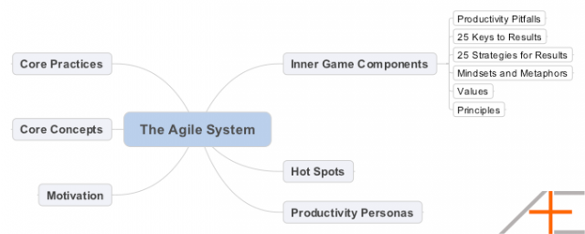

# Agile Results

is a different way of organizing your life and your productivity tools and systems. 

It relies on the concept of setting proper goals and outcomes, then directly linking your daily, weekly and monthly actions towards those goals and outcomes

* designed by JD Meier (a program manager at Microsoft)

## The Agile System

some terminologies here different from the standard Agile terminology

### core components

### Core Practices

* The Rule of 3

	daily outcomes, to weekly outcomes, monthly outcomes and yearly outcomes
	
	set 3 outcomes at each timeframe, and they become your focus (goals) for that timeframe.
	
	
* Cycles and Iterations

	Agile is all about adaptation and moving in cycles. Using cycles and iterations lets you try something, see if it works, and then quickly adapt and the following day or week as you need to course-correct.
	
