# 100卡路里

1/4巧克力羊角面包

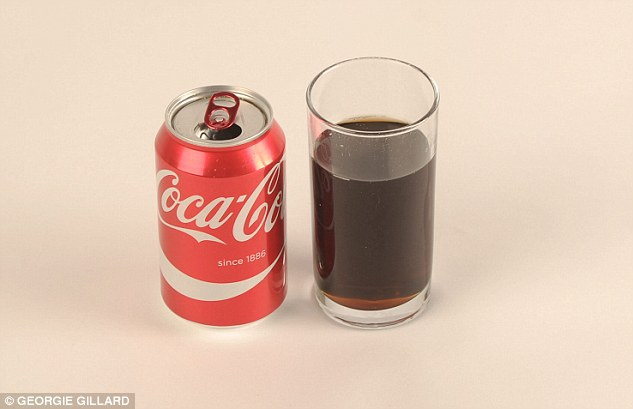

3/4听 cocacola

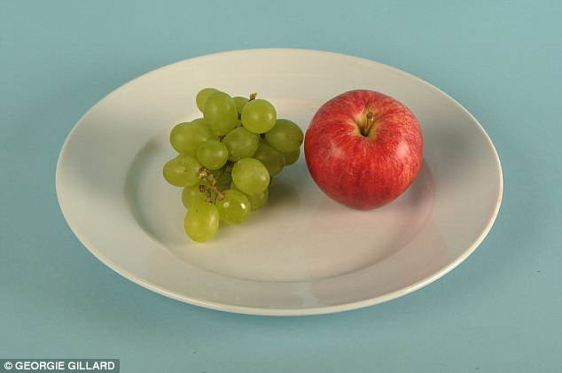
一整个苹果和一小串葡萄 one apple and a handful of grapes

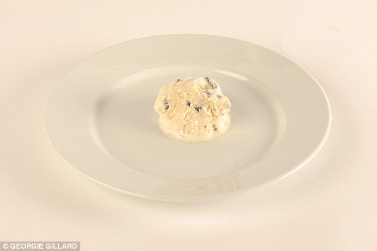

一勺哈根达斯冰淇淋 one scoop of Haagen-Dazs Cookies and Cream ice cream

 of an American blueberry muffin .jpg)
1/3个蓝莓麦芬蛋糕 A third (85g) of an American blueberry muffin 

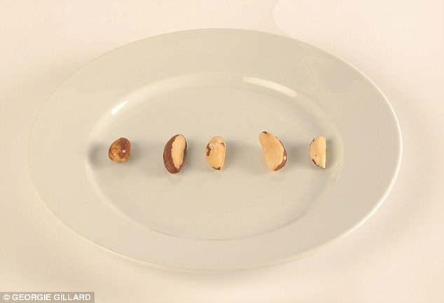
4.5枚巴西坚果 four and a half Brazil nuts

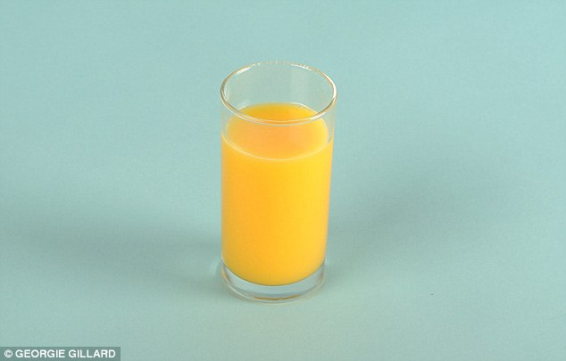

橙汁不超过200毫升 200ml glass of Tropicana orange juice

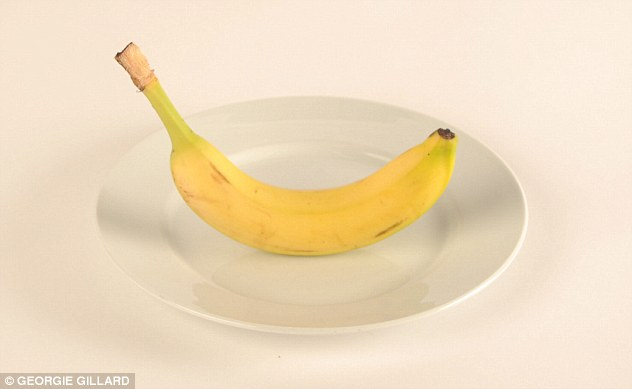

一根中等长度的香蕉 one medium banana

 and a solider of wholemeal toast.jpg)
1个水煮蛋和一小条全麦面包 For a protein-rich snack choose one boiled medium size egg (57g) and a solider of wholemeal toast

桑椹 80个才有100卡路里 80 blackberries

 .jpg)
150毫升巧克力奶昔 a third of a bottle of Frijj Chocolate milkshake (150ml) 

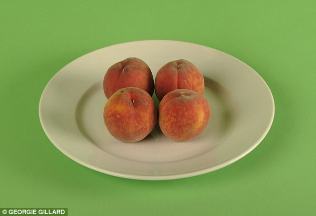
4个桃子 four peaches

1.5块奶油夹心饼干 one and a half custard cream biscuits

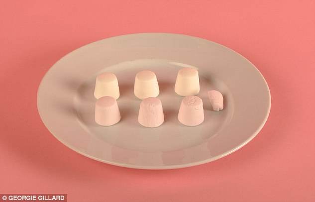
6又1/4个棉花糖 A stingy six and a quarter marshmallows

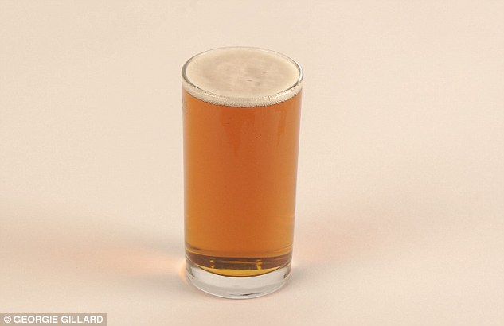
一小杯啤酒 half a pint of bitter

20克芝士 20g chunk cheese

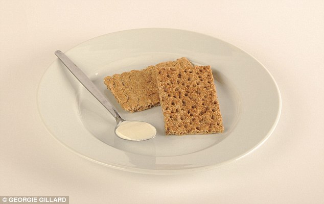
2块薄脆饼干和一勺低脂芝士 Two rye crispbread with one tablespoon of low fat soft cheese spread make a wholesome 100 calorie snack

.jpg)
23克海盐风味的薯片 a 100 calorie packet of seasalt flavoured Popchips (23g)

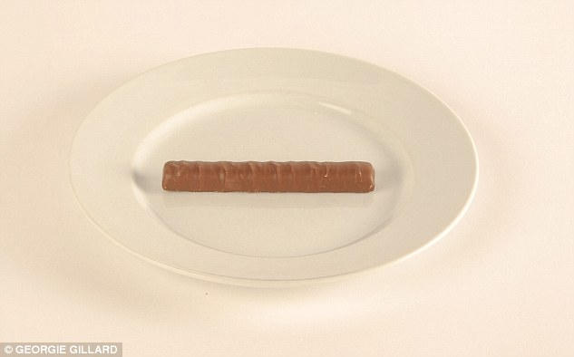
一根巧克力棒 one finger of a Twix

 and one apple.jpg)

125克脱脂酸奶和一个苹果 A whole pot of fat-free yoghurt (125g) and one apple will keep you full until lunch

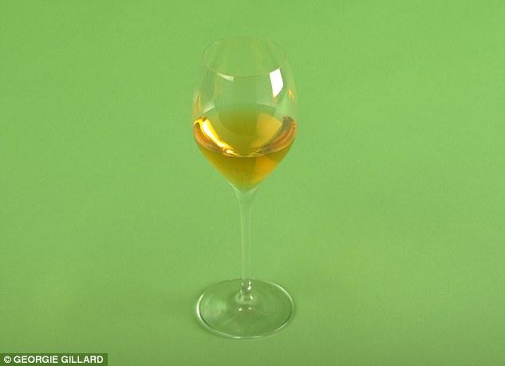
one 125ml glass of white wine

 with one teaspoon of low fat spread.jpg)
one slice of fruit loaf (35g) with one teaspoon of low fat spread

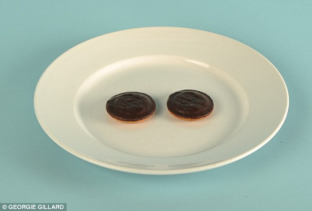

two Jaffa Cakes

27个草莓 An entire plate of 27 strawberries

 .jpg)
a whole pack of Twiglets original (24g) 

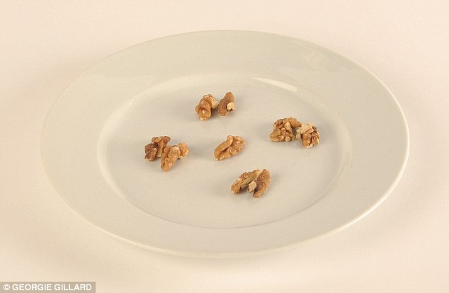
Four and a half walnuts

a tablespoon of sunflower seeds

A tablespoon of sweet raisins 

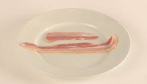

1又1/2条培根 one and a half rashers of streaky bacon

 of reduced fat hummus.jpg)
Enjoy dipping vegetable crudites into a big dollop (three tablespoons or 36g) of reduced fat hummus

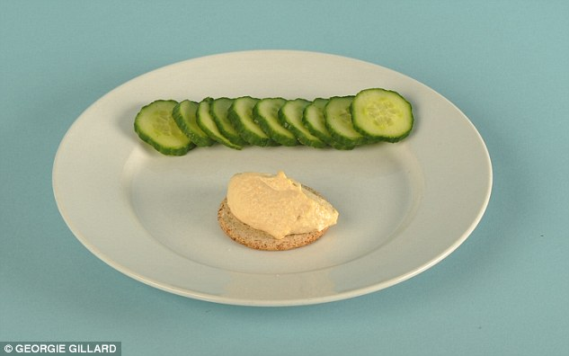

one tablespoon of reduced fat hummus on an oat cake and nibble on it with cucumber slices

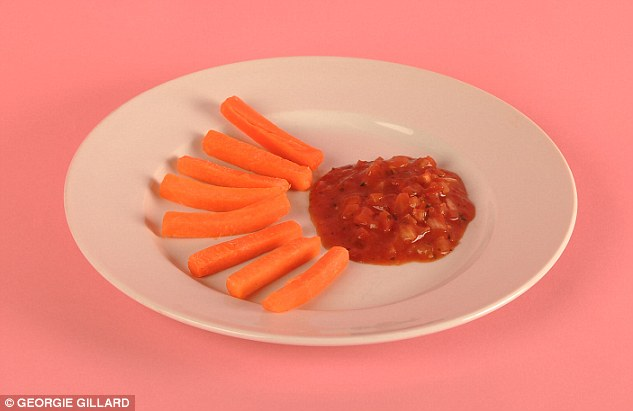

Enjoy eight carrot sticks and a tablespoon of salsa for another healthy snack

Half a Kit Kat Chunky

eight dried apricots

 .jpg)
Two rye crispbreads topped with two tablespoons of cottage cheese (80g) 