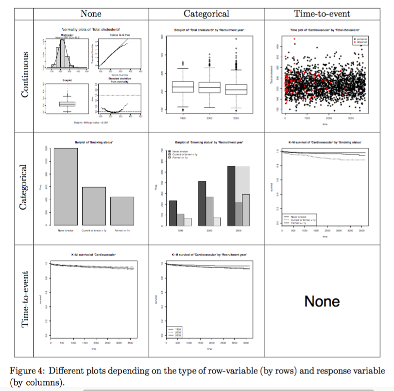

# package `compareGroups`: create descriptive tables in the paper

2015/11/17

`bivariate tables`: tables of descriptive statistics where rows are characteristics and each column is a group. Tables of this form are usually called bivariate tables

* formats

	* plain text
	* HTML
	* LaTex

	
* scenario

	* different statistics 

		* means
		* standard deviation
		* medians
		* etc

	* odds ratios when assessing univariate association between several variables and a binary response such as case-control status,

	* survival analysis 

		* hazard ratios
		* log-rank p values

* construction of the package

	* use existing functions from different R package	
	* classes
	* methods
	* generic functions

		* display
		
			* `print`
			* `plot`
			* `summary`	
		* modify

			* `update`
			* `subset`
			* `rbind`
* manually change

	* number of decimals
	* display absolute or relative freqencies
	* display or not the number of data avaialbe

* GUI frame built on

	* package `tcltk`
	* package `tcltk2`

* built-in example data set

	contains different data type
	
	* continuous
	* normal-distributed
	* categorical
	* binary
	* time-to-event

	* dataset `predimed`

		sample 85% data from the participants in the PREDIMED study (www.predimed.org).
		
		PREDIMED is a multicenter trial in Spain, were randomly assigned participants who were at high cardiovascular risk, but with no cardiovascular disease at enrolment, to one of three diets: a Mediterranean diet supplemented with extra-virgin olive oil (MedDiet+VOO), a Mediterranean diet supplemented with mixed nuts (MedDiet+Nuts), or a control diet (advice to reduce dietary fat). Participants received quarterly individual and group educational sessions and, depending on group assignment, free provision of extra-virgin olive oil, mixed nuts, or small non-food gifts. The primary end point was the rate of major cardiovascular events (myocardial infarction, stroke, or death from cardiovascular causes.
		
		
		
**OBSERVATIONS**:

1. It is important to note that compareGroups is not aimed to perform quality control of the data.
Other useful packages such as `r2lh` are available for this purpose.
2. It is strongly recommended that the data.frame contain only the variables to be analyzed; the ones
not needed in the present analysis should be removed from the list.
3. The nature of variables to be analyzed should be known, or at least which variables are to be used
as categorical. It is important to code categorical variables as factors and the order of their levels
is meaningful in this package.
4. The function label from the Hmisc package could be used to label the variables properly. The
tables of results will contain the variable labels (by default)

## 2. implementation

### 2.1 computations

For several variables (row-variables) it computes descriptives by groups of other variables (column-variable, grouping-variable or response)

can compute descriptives for the entire data set

* continuous: normal-distributed

	* mean
	* std

	test
	
	* 2 group: t test
	* more than 2 group: ANOVA
* continuous: not normal-distributed
	* median
	* 1st
	* 3rd quartile
	* min
	* max

	test
	
	* non-parametric Kruskall-Wallis test

	
* categorical

	* absolute frequencies
	* relative frequencies

	test
	
	* Chi-squared test
	* exact Fisher test when necessary

* survival

	* probability of event 
	* should be `Surv` class from package `survival`
	

		```r
		predimed$tmain <- with(predimed, Surv(toevent, event == Yes))
		library(Hmisc)
		label(predimed$tmain) <- "AMI, stroke, or CV Death"
		```


	test
	
	* continuous variable: Wald test from a Cox proportional hazard model
	* categorical variable: Kaplan-Meier log-rank test

Note that in a cohort study, an association test is not computed when the row-variable is of time-to-event type.

* more than 3 group

	* overall association
	* pairwise comparison

		* p value with multiple testing

		Example
		
		* continuous: normal distributed: Tukey tests
		* For the remaining cases, p values are corrected using the methodology described in Benjamini and Hochberg (1995)

			> Benjamini Y, Hochberg Y (1995). “Controlling the False Discovery Rate: A Practical and Powerful Approach to Multiple Testing.” Journal of the Royal Statistical Society B, 57(1), 289–300.
		
		* ordered group: trend test

* odds ratio

	* For categorical row-variables, one of the categories must be set as the reference; by default it is taken to be the first one but this can be changed very easily.
* longitudinal: hazard ratios


### 2.2 Constructing the bivariate table


some standard formats for bivariate tables

* continuous normal-distributed: means and standard deviations inside round brackets
* continuous non-normal distributed: median and quartiles between squared brackets
* categorical: both absolute and relative frequencies (inside round brackets)

	or only relative freqencies
	
* change the number of significant decimals


* When several bivariate tables are needed for different subsets of participants (e.g., males and females), it is possible to display them one beside the other. Very standard generic functions, cbind (or rbind when adding more variables to the table) have been implemented to do so. **See the vignette available in the package for more details.**

* display the number of available data (individuals) for each row-variable and group 

	Once the “bivariate object table” has been created, this can be done just by typing:`summary`
	
### 2.3. Reporting the bivariate table

* LaTex

	* can specify the caption
	* change font size
	* `longtable` environment
	* multicolumns
	* multirows
* HTML
* plain text csv

### 2.4 plotting

show graphically the distribution of the analyzed variables, both row-variables and response variable

construct: generic plot function

two types of plots

* display only row-variables (univariate plots) 
* show the relationship between each row-variable and the response variable (bivariate plots).



### 2.5 classes and methods

organization of classes, methods, and functions 

#### functions

1. function `compareGroups`: do all the calculations

	* descriptives
	* odds ratios
	* hazard rations
	* p values
	* etc

2. function `createTable`: pack all the descriptives, p values, etc. computed by function `compareGroups`

	* argument: control 

		* the format of the bivariate table 
		* the information displayed in it

3. display

	* function `export2latex`, `export2csv`, `export2html`, `export2pdf`: export the bivariate table created in the 2nd step

	* function `print`: print on the R console
	
#### classes
In each step, objects of different classes are created

#### methods

* display
	
	* `print`
	* `plot`: only for objects created in the 1st step
	* `summary`	
* modify

	* `update`: use when a bivariate table is created to be used as a “template” for a set of different tables, followed by just changing a few things such as the response variable subsequently
	* `subset` as usual
	* `rbind`


## 3 workflow to use the package

* Step 0: load data

	```r
	library("compareGroups")
	data("regicor", package = "compareGroups")
	```

* Step 1: function compareGroups do the calculation

	For all continuous variables, mean and standard deviation will be computed 
except for 

	* triglycerides
	* physical activity
	* physical component
	* mental component, 

	which will be treated as non-normal and consequently median, first and third quartiles will be calculated.


	```r
	res <- compareGroups(year ~ . - id - tocv - todeath, data = regicor,
	                     method = c(triglyc = 2, phyact = 2, pcs = 2, mcs =2), 
	                     selec = list(chol = txchol == 'No', hdl = txchol == "No",
	                                  triglyc = txchol == 'No', ldl = txchol == 'No'))
	res
	```

	output: 
	
	```
	-------- Summary of results by groups of 'Recruitment year'---------
	
	
	   var                           N    p.value  method                selection     
	1  Age                           2294 0.078*   continuous normal     ALL           
	2  Sex                           2294 0.506    categorical           ALL           
	3  Smoking status                2233 <0.001** categorical           ALL           
	4  Systolic blood pressure       2280 <0.001** continuous normal     ALL           
	5  Diastolic blood pressure      2280 <0.001** continuous normal     ALL           
	6  History of hypertension       2286 <0.001** categorical           ALL           
	7  Hypertension treatment        2251 0.002**  categorical           ALL           
	8  HDL cholesterol               1956 0.308    continuous normal     txchol == "No"
	9  Triglycerides                 1963 0.495    continuous non-normal txchol == "No"
	10 LDL cholesterol               1870 <0.001** continuous normal     txchol == "No"
	11 History of hyperchol.         2273 <0.001** categorical           ALL           
	12 Cholesterol treatment         2239 <0.001** categorical           ALL           
	13 Height (cm)                   2259 0.003**  continuous normal     ALL           
	14 Weight (Kg)                   2259 0.150    continuous normal     ALL           
	15 Body mass index               2259 <0.001** continuous normal     ALL           
	16 Physical activity (Kcal/week) 2206 <0.001** continuous non-normal ALL           
	17 Physical component            2054 0.001**  continuous non-normal ALL           
	18 Mental component              2054 <0.001** continuous non-normal ALL           
	19 Cardiovascular event          2163 0.161    categorical           ALL           
	20 Overall death                 2148 <0.001** categorical           ALL           
	-----
	Signif. codes:  0 '**' 0.05 '*' 0.1 ' ' 1 
	
	```

* Step 2: function createTable creates the bivariate table

	```r
	restab <- createTable(res, hide.no = "no", type = 1)
	```
	
*  Step 3: display
	* on R console

	```r
	restab
	```


	output: 

	```
	--------Summary descriptives table by 'Recruitment year'---------
	
	__________________________________________________________________________________________ 
	                                    1995             2000             2005       p.overall 
	                                   N=431            N=786            N=1077                
	¯¯¯¯¯¯¯¯¯¯¯¯¯¯¯¯¯¯¯¯¯¯¯¯¯¯¯¯¯¯¯¯¯¯¯¯¯¯¯¯¯¯¯¯¯¯¯¯¯¯¯¯¯¯¯¯¯¯¯¯¯¯¯¯¯¯¯¯¯¯¯¯¯¯¯¯¯¯¯¯¯¯¯¯¯¯¯¯¯¯ 
	Age                             54.1 (11.7)      54.3 (11.2)      55.3 (10.6)      0.078   
	Sex:                                                                               0.506   
	    Male                           47.8%            49.6%            46.9%                 
	    Female                         52.2%            50.4%            53.1%                 
	Smoking status:                                                                   <0.001   
	    Never smoker                   56.4%            54.6%            52.2%                 
	    Current or former < 1y         26.3%            35.2%            20.5%                 
	    Former >= 1y                   17.3%            10.2%            27.4%                 
	Systolic blood pressure          133 (19.2)       133 (21.3)       129 (19.8)     <0.001   
	Diastolic blood pressure        77.0 (10.5)      80.8 (10.3)      79.9 (10.6)     <0.001   
	History of hypertension            25.8%            29.6%            35.5%        <0.001   
	Hypertension treatment             16.5%            16.2%            22.2%         0.002   
	HDL cholesterol                 52.0 (14.5)      52.6 (15.8)      53.3 (14.2)      0.308   
	Triglycerides                 92.0 [70.0;131]  97.0 [72.0;132]  93.0 [70.0;132]    0.495   
	LDL cholesterol                  151 (38.6)       149 (39.0)       137 (39.6)     <0.001   
	History of hyperchol.              22.5%            33.2%            33.2%        <0.001   
	Cholesterol treatment              6.50%            8.80%            12.8%        <0.001   
	Height (cm)                      163 (9.21)       162 (9.39)       163 (9.05)      0.003   
	Weight (Kg)                     72.3 (12.6)      73.8 (14.0)      73.6 (13.9)      0.150   
	Body mass index                 27.0 (4.15)      28.1 (4.62)      27.6 (4.63)     <0.001   
	Physical activity (Kcal/week)  390 [226;617]    347 [185;574]    262 [127;443]    <0.001   
	Physical component            51.7 [44.8;54.6] 51.9 [44.4;55.6] 53.1 [45.4;55.9]   0.001   
	Mental component              52.3 [44.6;56.9] 52.8 [42.7;57.0] 49.7 [40.7;55.1]  <0.001   
	Cardiovascular event               2.51%            4.72%            4.59%         0.161   
	Overall death                      4.65%            11.0%            7.23%        <0.001   
	¯¯¯¯¯¯¯¯¯¯¯¯¯¯¯¯¯¯¯¯¯¯¯¯¯¯¯¯¯¯¯¯¯¯¯¯¯¯¯¯¯¯¯¯¯¯¯¯¯¯¯¯¯¯¯¯¯¯¯¯¯¯¯¯¯¯¯¯¯¯¯¯¯¯¯¯¯¯¯¯¯¯¯¯¯¯¯¯¯¯ 
	```

	* on LaTex
	
	```r
	export2latex(restab, loc = "bottom",
	             caption = "Descriptives by year.", size = "small")
	```


	* on html

	```r
	export2html(restab, loc = "bottom",
	            caption = "Descriptives by year.", size = "small")
	```


* Step 4: update: perform descriptives of the same variables by sex instead of year

	```r
	export2latex(update(restab, x = update(res, sex ~ . -sex)),
	             loc = "bottom", caption = "Descriptives by sex.")
	```

### 3.2 by GUI

function `cGroupsGUI(datasetName)`


