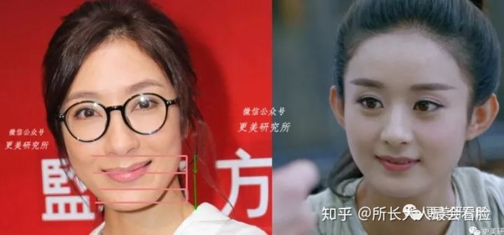

<!--toc-->

下巴符合这三个维度

1. 正脸: 比例
2. 正脸: 形态
3. 侧脸: 凸度

1. 比例

	标准比例: 1:2
	
	
	
	
	
	大于 1:2 显年龄小
	
	
	
	大于 1:2 显老泰
	
	
	
2. 形态

	
	
	1. 圆下巴: 年纪小
		
	2. 鼓下巴: 高贵、宽容

		
	3. 长下巴: 成熟
		
		

	4. 尖下巴: 美艳

		
		
	5. 方下巴: 一般多出现在男生脸上，会更具英气，整个人看起来略显固执。

		
3. 凸度

	

	1. 标准

		
	2. 下巴后缩

		
	

## 瑞氏审美平面

瑞氏审美平面鼻尖点-唇突点-下巴前点，是可以连成一条直线的。通常亚洲人的上下唇刚好在此线上，而欧洲人面部立体高差大，一般唇前点在线条后面哦。

## 斯式审美平面
斯式审美平面鼻尖到人中的中点与下巴前点的连线。

## 下巴后缩

如果是单纯的下巴后缩，视觉上会有一种嘴凸的感觉。 **正面侧面都会有一种凸嘴的感觉**。

下颌后缩会造成下巴短。

是因果关系。

舌头放上颚这一点注意一下 不只是说舌尖顶着 要整条舌头都在上颚 包括舌根之类的 平时多注意就习惯了

耳朵和肩膀应该要成一条直线，但是长期低头或者有驼背问题的女生，侧面看会发现她们的耳朵比起肩膀更向前一点。

走路时候, 挺胸之外，眼睛稍微向上看。

**下颌后缩是侧面短，下巴短是正面短。**

## 颏唇沟

**有颏唇沟才美**

