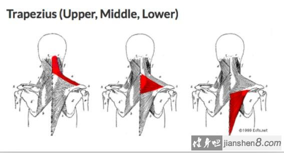
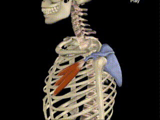

让肘和手，键盘在一个平面上
很多时候如果肘低于手腕就会出现不自觉耸肩来适应双手工作的情况

颈椎反弓

锁骨的运动往往伴随肩带的整体运动。

## 医学定义的斜方肌

斜方肌 = trapezius

通常容易让我们看起来虎背熊腰的就是斜方肌上部这个区域。

斜方肌，是位于颈后部和背部皮肤下的浅层肌肉，单侧形似三角形，按照肌纤维的走向分为上中下三束，其功能为：

1. 上束收缩，上提肩胛骨（即缩脖子耸肩）
2. 下束收缩，下降肩胛骨（即沉肩）
3. 整体收缩，拉肩胛骨向脊柱中线靠拢。

上斜方肌：上抬及上回旋肩胛骨

中斜方肌：辅助肩胛骨内收

下斜方肌：下压及上回旋肩胛骨

外层斜方肌, 内层菱形肌

菱形肌的肌纤维由肩胛骨内侧缘斜向上向内，其功能为小幅度上提肩胛骨、拉肩胛骨向脊柱中线靠拢。

由功能上看，斜方肌中下束与菱形肌是有交叉区间的：拉肩胛骨向脊柱靠拢，也就是回缩肩胛骨。

在训练时，只要有肩胛骨主动靠拢的动作，就是这哥俩在发力了，也就能练到了这两块肌肉。

## 窄义斜方肌 = 上斜方肌

正面看，斜方肌高耸入云，显得很粗壮，快淹没了脖子……

但从侧面来看，她的斜方肌只有薄薄的一层，完全不大，并不发达。

也就是说，所谓的斜方肌“发达”并不是真正意义上的发达，而是因为它由于肌肉长期处于缩短的状态而导致它过于紧张，变成了一个无用、没有活力的“结”，看上去发达却没有力量的状态。有些人的斜方肌内甚至形成了**肌肉结节**。

下面看斜方肌上束的功能：手臂上举及外旋肩胛骨，协助头部后仰，侧屈及旋转。

解决办法：所以第一学习动作肩胛骨稳定性很重要，另外你在锻炼的时候尽量避免或者减少手臂上举及外旋肩胛骨，协助头部后仰，侧屈及旋转的动作。

## 真正斜方肌发达

## 漂亮的头颈

## 上斜方肌太壮

斜方肌过于紧张，根源还要从胸肌找起。含胸的人，一般是因为胸小肌缩短（过紧）导致肩胛骨前引，前伸的肩胛骨使斜方肌中下部分的肌纤维被拉长，慢慢变得松弛无力。斜方肌中下部肌纤维松弛无力，斜方肌上部只能背锅，承担责任使肩胛骨后缩的责任，但是这根本不是它该干的事！协同肌支配，上斜方肌干它不该干的活了，付出就会更多，于是也变得比较紧张，这也就是含胸的人一般斜方肌都容易不舒服的原因。

锻炼和拉伸。

* 需要锻炼的肌肉：中下斜方肌、菱形肌、前锯肌；
* 需要拉伸和放松的肌肉：斜方肌上束、斜角肌、胸小肌。

前伸的肩胛骨使斜方肌中下部肌被动拉长，这里的拉长你可以理解为变松弛。通过动图感受一下背部斜方肌是不是被拉长了。

胸肌过度紧张，会进一步作用到斜方肌中下部肌纤维，它二次被拉长，就导致肌力下降。而为了能拉住过度前伸的肩胛骨，斜方肌中下部会变得紧张、无力。

来个总结版吧：

1、含胸时肩胛骨位置不正确，导致下斜方肌被动拉长

2、胸肌紧张导致下斜方肌被动拉长

3、下斜方肌被拉长、肌肉无力，导致上斜方肌借力来完成它的工作

	

## 上斜方肌小

## 保持耸肩的原因

有了富贵包, 整个肩是向下斜. 为了使肩和颈成直角, 耸肩就能达到. 所以我在不了解之前根本就不可能不耸肩

## 上斜方肌练壮的原因

1. 喜欢长时间低头玩手机

	
	
	
	
2. 喜欢“头前伸”姿势工作学习

	
	
3. 提拉重物
4. 晚上喜欢侧睡
5. 床太软、枕头不合适
6. 长时间背单肩包
7. 缺乏基础的运动，导致肌肉力量不均衡
	
绝大部分带有耸肩的动作，都是包含肩胛骨上回旋的动作，也就容易锻炼到斜方肌上部。

这个很容易感觉得到，大家可以用手摸着肩胛骨，然后耸耸肩，就能感觉到肩胛骨被提起来了，这个时候就是在做上回旋。

别低头，斜方会大

而且一直低头，斜方肌要一直被迫工作，得不到休息，持续被压榨，时间长了还会劳损，所以**脖子后边疼**的姐妹，真的要反思一下自己的生活习惯了。

## 怎么判断上斜方肌在参与

正经的方法还是应该看看肩胛骨是不是上回旋了，但是如果自己一个人练，根本看不到后背啊

另外一个方法，那就是看锁骨

通常来说在过度耸肩的情况下，锁骨也算会跟着上提的，所以锻炼的时候如果你看到自己的锁骨明显有上翘的情况，那说明大概率有耸肩的情况发生。

## 如何减少上斜方肌参与

尽量不低头，平时把电脑屏幕抬高一些，看手机的时候也受累把手抬高一些。

## 美丽芭蕾 天鹅臂

在美丽芭蕾天鹅臂的视频中，

主要锻炼的肌肉群为**三角肌**

肩胛骨向下沉，同时要扩肩（大臂和肩的连接处向远蹬开的感觉）

向两侧扩肩的同时肩胛骨向里夹

就是一种对抗的力量

然后大臂带动小臂

* 优雅姿态Beautiful Postures: 保持脖子修长
* 利用核心Engage with Your Center

	1. 平板支撑利用的是核心；卷腹利用的是核心；天鹅臂利用的当然也是核心。MHB老师对“利用核心”的解释是“保持收腹”。

		但是作为一个喜欢利用“饭后不能立刻坐下的半小时”练习天鹅臂的女孩...我觉得首先是不能吃太多。胃里太满的话，练的时候收腹会很难受，别问我是怎么知道的...

	2. 呼吸。练习普拉提时讲究“**用鼻吸气、用嘴呼气**”的腹式呼吸，达到配合核心发力的效果。放在天鹅臂练习中，也很实用。还可以在抬不动胳膊时用力+呼气，放松+吸气，达到使出吃奶的劲的效果。

* 手臂姿势Techniques of Arms
* 融入日常 Translate into Regular Life

	要把练习的结果融于到日常生活的行、走、坐、站、卧中。
	
	所以练习天鹅臂更多的意义在于：让平时伏案工作/学习的上交叉综合症人群有机会唤醒背部肌肉、打开胸腔、找回昂首挺胸的feel，进而能在日常生活的举手投足保持住
	
	1. 腹部发力
	2. 背部夹紧
	3. 脖子修长的姿态。
	

	
正确的姿势达到的效果

1. 含胸驼背被矫正
2. 锁骨非常明显
3. 肩膀胳膊全部都瘦下来了。

错误的姿势

1. 练斜方肌 = 肩胛骨痛
2. 脖子练粗

一直保持后缩肩胛骨的状态

如果你想避免斜方肌发力，只需要在做动作时保证锁骨不晃动就可以了。

在开始推掌之前，把肩膀往后旋，然后用力沉肩膀。

如果斜方肌又高又发达，三角肌又相对弱，看起来整个肩部是斜向下的溜肩. 里面是肩胛提肌

沉肩有两个点要注意，不是将肩膀压下来就是沉肩，除此之外需要您挺胸抬头，并感受到肩胛骨的位置，控制它稳定，就是大家说的锁死，肩胛骨锁死就是让它稳定，

### 1.  手臂上下摆

大臂外展 => 刺激三角肌中束

这个动作很多人说练完后斜方肌更紧张了，有人说是因为耸肩导致的，所以强调一定不能耸肩。

确实，对于一些知道三角肌发力是什么感受的人来说，可以在抬起手时分离开三角肌和斜方肌，仅通过三角肌将手臂抬起来。

但是，对于很多没有这方面经验的人来说，当手臂抬高到一定高度时或动作做一段时间后，会不由自主的耸肩。即使你告诉他/她控制住肩胛骨，并且保持下沉balabala......她/他在做抬手的动作时候还是会耸肩。

这是因为，三角肌和背部（菱形肌）缺乏耐力和力量，身体为了做出抬手臂的动作，强迫使用斜方肌帮助抬高手臂

做一定时间后，也无法保证每次斜方肌都不用力，也会或多或少的耸肩。

因此，对于这个动作的改变方法：

1. 做的时候保持挺胸，肩膀打开。

2. 大臂展开到肩膀高度便停止落下，不要超过肩膀。

根据肩膀的疲劳程度，适当的减少视频中动作的次数。视频中每个动作几乎做的是4$\times$8，我建议刚开始的同学每个动作做2$\times$8就够了，之后再慢慢增加。

### 2. 手臂高位外推

通过保持手臂抬起来刺激三角肌。同时，摆动小臂和手腕增加了不稳定性，这样迫使肩关节处需要调动更多的肌肉群来稳定体态，也对三角肌造成更大刺激。（当然，也可以看做是花哨的东西，摆不摆小臂和手腕都可以）

### 3. 手臂水平外推

大臂小幅度上下摆动。

大臂外展 => 刺激三角肌中束

手肘不弯曲上下摆动（不超过肩膀高度）也可以达到同样效果。

但如果你不像视频里手往外推，你会像只打水的鸭，而不是一只优雅的鹅，相信我，我试过。

https://zhuanlan.zhihu.com/p/107297408

**收腹沉肩收缩肩胛骨**

> up脖子两边酸怎么回事?
> 做的时候，手臂尽量不要抬得太高，不是越高越好哦，太高会导致耸肩！
> 

##  口呼吸

先吞咽一下，看看舌位抵在上颚的哪里，之后就保持那个舌位。

不要用大力咬着牙, 就是轻轻咬合就行