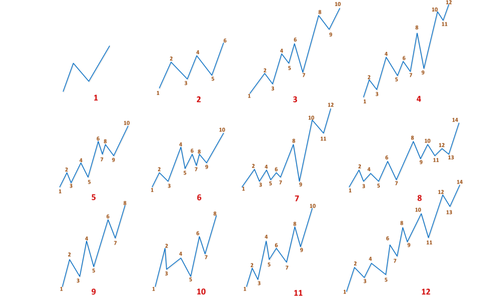
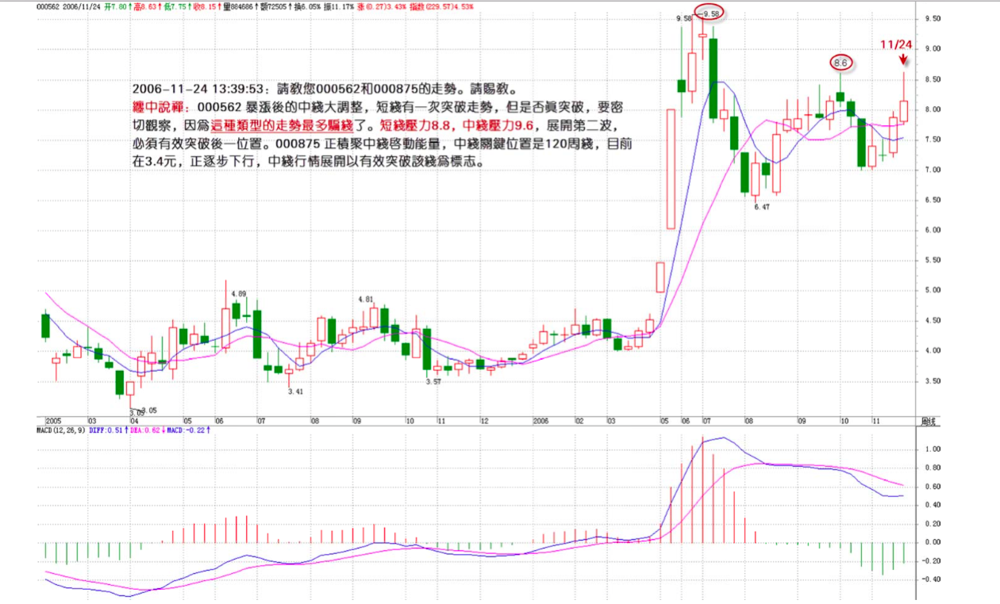
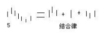

## 练习

* **缠中说禅走势分解定理一**：任何级别的任何走势，都可以分解成同级别“盘整”、“下跌”与“上涨”三种走势类型的连接。
* **缠中说禅走势分解定理二**：任何级别的任何走势类型，都至少由三段以上次级别走势类型构成。
* **缠中说禅盘整**：在任何级别的任何走势中，某完成的走势类型只包含一个缠中说禅走势中枢，就称为该级别的缠中说禅盘整。
* **缠中说禅趋势**：在任何级别的任何走势中，某完成的走势类型至少包含两个以上依次同向的缠中说禅走势中枢，就称为该级别的缠中说禅趋势。该方向向上就称为**上涨**，向下就称为**下跌**。

* 顺次$n$个包含关系k线组, $n \in \aleph$

	* 向上: 等价于 $$[\max_{1 \le i \le n} d_i,\max_{1 \le i \le n} g_i]$$ 的区间对应的k线
	* 向下: 等价于 $$[\min_{1 \le i \le n} d_i,\min_{1 \le i \le n} g_i]$$ 的区间对应的k线

	
* 画笔
* 线段划分练习

	
* **对应的2种线段破坏的基本形式**

	

	

	1. 向上线段被破坏

		find $i$ and $j$, $i+2 \le j$ such that $g_i \ge d_j$
	1. 向下线段被破坏

		find $i$ and $j$, $j \ge i+2$ such that $g_j \ge d_i$

	

	* i=1, j=3，$d_3<g_1$, 在$d_3$时已经出了笔破坏
	* i=2, j=4, $d_2<g_4$, 在$d_4$时笔被破坏

## 中小资金的买卖法

* 持股不超过3只
1. 6种组合代表着3类不同的走势， 只参与**下跌+上涨**

	**在第一类买卖点买入后， 一旦出现盘整走势，无论后面如何， 都马上退出**

	分析：

	**下跌+上涨**前的走势只会有2种： 上涨、盘整

	1. 上涨+下跌+上涨：在上一级别的图形中是一个盘整。　只参与下跌+上涨，　因此不考虑
	2. 盘整＋下跌＋上涨：盘整＋下跌之后出现第一类买点。 这个下跌是跌破前面盘整的， 否则就不会构成“盘整+下跌”型， 只会仍是盘整。

	盘整＋下跌＋上涨 前的走势只有2种：上涨，下跌

	* 上涨＋盘整＋下跌＋上涨　＝＞　高一级别的盘整　＝＞　不考虑
	* 下跌＋盘整＋下跌＋上涨　＝＞　只剩下这种情况

2. 由1的分析　＝＞　下跌＋盘整＋下跌＋上涨　＝＞　对股票的选择只有一种情况（２个要求):
	
	1. 出现第一类买点　
	2. 第一类买点之前的走势是“下跌＋盘整＋下跌”
3. **下跌+上涨**买卖方法选择买入品种的标准程序
	1. 只选择出现“下跌＋盘整＋下跌”走势
	2. 在该走势的第二段下跌出现第一类买点是介入
	3. 介入后，一旦出现盘整走势，　坚决退出

	这个退出肯定不会亏钱，　因为可以利用第一级别的第一类买点退出

	盘整的坏处：

	1. 浪费时间　
	2. 盘整后存在一般的可能是下跌

4. 日线上“下跌＋盘整＋下跌”会需要很长时间，　比如1年
5. 上涨＋盘整＋上涨　走势，　一旦第二类升段出现第一类卖点，一定要走，　因为后面可能就出现“上涨＋下跌”走势

	背离：MACD红柱子一次比一次矮

## 大资金的买卖法， 不做庄

1. 安全建仓： 6种组合代表着3类不同的走势， 只参与****下跌＋盘整＋上涨****
2. 建仓都是动态的，如果成本没被降到一定值，建仓完不了。一个天大的误解，就是建仓时成本要很高，其实高明的人，建仓时，成本就可
	以不断下降，当然，这种手法，对没耐心、没短线思维的人，是痛苦的。所以本 ID 说过，散户也要学会动态建仓。
3. 标的

	1. 找牛的行业
	2. 具体企业的寻找。对于长线投资来说，最牛的股票与最牛的企业，最终是必然对应的。
	3. 资金管理

		1. 用最大的比例，例如70%，投在龙头企业（可能是两家）中
		2. 把其他30%分在最有成长性（可能是两三家）的企业中。注意，在实际操作中，如果龙头企业已经在基本面上显示必然的败落，那当然就选择最好的替代者，如此类推。
二、只要这个行业顺序不变，那么这个投资比例就不变，除非基本面上出现明显的行业地位改变的迹象，一旦如此，就按等市值换股。当然，如果技术面把握好，完全可以在较大级别卖掉被超越的企业，在其后的买点再介入新的龙头已经成长企业。
三、这就是本ID理论的独门武器了，充分利用可操作的中枢震荡（例如日线、周线等），把所有投资成本变为0，然后不断增加可持有筹码。注意，这些筹码，可能是新的有成长或低估价值的公司。
四、没有第四，如果一定要说，就是密切关注比价关系，这里的比价关系，就是市值与行业地位的关系，发现其中低估的品种。
注意，任何的投资，必须是0成本才是真正有意义的。
以上这个策略，就是基本面、比价关系，与技术面三个独立系统完美的组合，能这样操作股票，才有点按本ID理论操作的味道。
当然，以上，只适合大资金的操作，对于小资金，其实依然可以按照类似思路，只是只能用简略版，例如，就跟踪龙头企业，或者就跟踪最有成长性的那家。
当然，对于原始资本积累的小资金，利用小级别去快速积累，这是更快速的方法，但资金到一定规模后，小级别就没有太大意义了。
有人可能说，你怎么不说政策面？政策面那种玩意，不过是制造最多是周线级别的震荡，这正是提供技术上降低成本、增加筹码的机会。1929年、二次世界大战，都没改变美国股市年线级别的中枢移动，政策面又算得了什么？
​

## 坐庄

## 资金管理方法： 当成本为0以前，要把成本变为0；当成本变成0以后，就要挣股票，直到股票见到历史性大顶，也就是至少出现月线以上的卖点。

最坏的习惯: 股票不断上涨，就不断加仓，这样一定会出问题。买股票，宁愿不断跌不断买，也绝对不往上加码。

投入资金买一只股票，必须有仔细、充分的准备，这如同军队打仗，不准备好怎么可能赢？在基本面、技术面等方面都研究好了，介入就要坚决，一次性买入。如果你连一次性买入的信心都没有，证明你根本没准备好，那就一股都不要买。

买入以后，如果你技术过关，马上上涨是很正常的，但如果没这水平，下跌了，除非证明你买入的理由没有了，技术上出现严重的形态，否则都不能抛一股，而且可以用部分机动的资金去弄点短差（注意，针对每只买入的股票，都要留部分机动的资金，例如1/10），让成本降下来，但每次短差，一定不能增加股票的数量，这样，成本才可能真的降下来，有些人喜欢越买越多，其实不是什么好习惯。这股票该买多少，该占总体资金多少，一开始就应该研究好，投入以后就不能再增加。

股票开始上涨后，一定要找机会把股票的成本变成0，除了途中利用小级别不断弄短差外，还要在股票达到1倍升幅附近找一个大级别的卖点出掉部分，把成本降为0。这样，原来投入的资金就全部收回来了。有人可能要说，如果那股票以后还要上涨10倍呢？这没问题，当股票成本为0以后，就要开始挣股票。也就是利用每一个短差，上面抛了以后，都全部回补，这样股票就越来越多，而成本还是0。这样，这股票就算再上涨100倍，越涨你的股票越来越多，而成本永远为0，这是最可怕的吸血，庄家、基金无论如何洗盘，都使得你的股票越来越多，而你的成本却是0，然后，等待一个超大级别的卖点，一次性把他砸死，把那庄家、基金给毁了。想想，成本为0的股票，在历史大顶上砸起来是最爽的。
这就是资金管理中针对每只股票的最大原则，按照这原则，你不仅可以得到最安全的操作，而且可以赢得最大的利润。特别挣股票的阶段，一般一个股票，盘整的时间都占一半以上，如果一个股票在上涨后出现大型盘整，只要超大级别卖点没出现，这个盘整会让你的股票不仅把抛掉的全挣回来，而且比底部的数量还要多，甚至多很多。一旦股票再次启动，你就拥有比底部还多的但成本为0的股票，这才是最大的黑马，也是最大的利器。一个合理的持仓结构，就是拥有的0成本股票越来越多，一直游戏到大级别上涨结束以后，例如这轮大牛市，直到牛市结束前，才把所有股票全部清仓。而资金，就可以不断增加参与的股票种类，把这程序不断下去，这样，操作资金不会增加，特别对大资金，不会经常被搞到去当庄家或钱太多买了没人敢进来，这样就不会增加操作的难度，但股票种类越来越多，但成本都是0。这样，才会有一个最稳固的资金管理基础。

一个最简单又最有效的管理

Stage 1: 当成本为0以前，要把成本变为0
用部分机动的资金去弄点短差（注意，针对每只买入的股票，都要留部分机动的资金，例如1/10），让成本降下来，但每次短差，一定不能增加股票的数量，这样，成本才可能真的降下来
股票开始上涨后，一定要找机会把股票的成本变成0，
除了途中利用小级别不断弄短差外，还要在股票达到1倍升幅附近找一个大级别的卖点出掉部分，把成本降为0。

Stage 2: 当成本变成0以后，就要挣股票
利用每一个短差，上面抛了以后，都全部回补，这样股票就越来越多，而成本还是0。
这样股票就越来越多，而成本还是0。这样，这股票就算再上涨100倍，越涨你的股票越来越多，而成本永远为0，这是最可怕的吸血，庄家、基金无论如何洗盘，都使得你的股票越来越多，而你的成本却是0，

Stage 3: 直到股票见到历史性大顶，也就是至少出现月线以上的卖点
等待一个超大级别的卖点，一次性把他砸死，把那庄家、基金给毁了。想想，成本为0的股票，在历史大顶上砸起来是最爽的。

Rule:

* 买股票，宁愿不断跌不断买，也绝对不往上加码
* 如果你技术过关，马上上涨是很正常的，但如果没这水平，下跌了，除非证明你买入的理由没有了，技术上出现严重的形态，否则都不能抛一股
* 这股票该买多少，该占总体资金多少，一开始就应该研究好，投入以后就不能再增加。
​

## 课程

各位知道为什么智慧难得吗?就因为偷心不死,整天想着捷径,想着一夜暴富。 你看看真正成功的人,有哪个是靠中彩票的?要在市场上成功,首先要把这偷心给废了,否则学什么都没用,一到场上就犯糊涂,然后就后
悔、自责,然后又继续犯糊涂。

每道题都没有把特例思考好,一种特殊的情况往往是操作中最大的敌人,而能否把所有特殊的情况
都思考到,这是很关键的地方

盘整是用来降低自己成本的,抬高别人成本的

核心: 走势必完美
任何预测，都必须基于严格分类的基础上，这是一个最基本的思维，否则，整天陶醉在纯概率的游戏中，只能是无聊当有趣。
本级别的笔中枢就是次级别的线段中枢
本级别的线段中枢就是更高级别的笔中枢

图可以被唯一划分成

* 笔
* 线段
* 走势

分类

* 走势
	* 趋势

		* 上涨
		* 下跌
	* 盘整

笔形成的是类中枢，线段形成的是中枢

* 一个趋势 由 **至少有 9 段走势** 做成

	* 有两个中枢,因此至少就有 6 段走势
	* 前面低部回拉的第一段
	* 最后冲刺的一段
	* 连接两个中枢的一段

## 其他

* 技术习惯: 只要在3%的范围内,都是可以认为目标位触及有效
* 中长短级别

	* 1分线: T＋0
	* 5分线: 超短线 (有人说, 这个才是T+0的买卖点, 1分钟作为参考)
	* 30分线: 短线
	* 60分线: 波段
	* 日线: 中短线, 波段
	* 周线: 中线
	* 月线: 长线

注意，本ID说了只坐轿子，但没有任何地方，本ID曾经说要看空。本ID之所以能在市场中生存十几年而不断壮大，唯一秘诀就是底部之后只坐轿子。本ID的方法很简单，就是留了机动的资金后，把仓位打到最大，然后不断在出现中枢震荡时，保持仓位把差价搞出来。一般情况下，到一段行情顶部的时候，本ID原来的仓位都要下降到70%-75%，注意，筹码不丢失，只是钱多出来，所以仓位自然下来了。这样，无论发生什么，本ID都是大赢了。

在市场中，关键是能长期保持赢利，本ID从来没见过喜欢当轿夫的最终能活下来的

* 适用市场

	* 美股: 走势比较标准
* 不适合

	* 外汇: 小级别的拐点不好找，失败率很高
	* 三买是一买技术在回调走势中的应用，需要注意的是，这类买点最好只用于强市中强势股的回调，否则极易下杀造成中枢扩展

* 介入股票最好在均线粘合处. 底部放巨量是一个好的短线出手机会

	* 在刚启动的时候买, 中线大幅上涨后在等中线调整结束再买, 虽然会浪费很多所谓的机会, 但这样一定能活下来

		牛市随便买都会挣钱, 一旦养成这个习惯, 以后就麻烦大了

	* 不要等拉了大阳线才买股票, 一定要习惯于在放量突破回调时买股票, 风险小很多
* 特别散户,绝对不要抄底, 一定要等股票走稳将启动才介入
* 养成尽量不玩第二波的习惯
* 三角形整理的最后骗线. 第一波走势太强, 其后调整时间又太长的股票, 充满骗线
* 投资的大忌: 不要再以巨量大阴线构造顶部的下跌反抽中介入

	
* 骗线

	

* Q: 今夜外汇市场美元大跌, 下周对股市会有何影响

	A: 这种思维方式是完全错误的, **不要预测任何信息的影响**, 而是要**仔细观察市场对消息的所有消息的综合反映**,i.e.,**市场的走势本身**. **消息是来测试市场体制的, 而不是来预测的**
* 不要习惯问

	* 会涨多少才是顶
	* 会跌多少才是底

	持有一直等待行情结束的信号产生
* **养成不追高的好习惯**
* 所有操作的困难都是操作的失误造成的, 养成好习惯是投资第一重要的事情. 别怕机会都没了, 市场中永远有机会, 关键是有没有发现和把握机会的能力, 而这种能力的基础是一套好的操作习惯, 这样所有的操作都没有什么两难的地方, 都很简单
* **真正的高手从来不迎难而上, 把自己整天搞到置之死地而后生**
* "用你的眼睛去看, 用你的心去感受"

	1. 不要受消息,情绪等等的影响, 这样才能看得清楚, 然后心才会敏感

		先把一些基础的东西编程自己的一种本能反应, e.g., 建立符合自己的有效的操作程序

* 学习

	1. 不断总结, 不能被胜利冲昏头脑
	1. 市场操作是一个武功修炼的过程, 不能把自己局限在一个境界里

		1. 摸索总结
		1. 寻求突破
		1. 达到一个新境界

		都是自我修炼的过程
* 不要对有规律的走势产生定势, 人经常就是这样被杀的
* 最好不要满仓参与风险太大的品种. 赚钱是一辈子的事情, 而不是一锤子的买卖
* 如果不是强力突破的走势, 一般最好别早上买股票, 因为没有T+0, 经常下午可以有很好的选择. 如果中线着眼, 逐步减仓, 那是另一回事
* Q: 请问600036调到位了吗?

	A: 一定要改变思维模式, 不要问什么调整到位没有的问题, 而是要问自己搞的标准是什么

	唯一正确的问法是: 600036现在符合自己搞的标准码?若不知道, 请先停下, 想清楚
* 不是本ID自吹自擂：

	* 能让你八卦的博客，不能让你有品位；
	* 能让有品位的，不能让你智慧；
	* 能让你智慧的，不能让你挣钱；
	* 能让你挣钱的，不能让你明心。
	* 而能让你八卦、品位、智慧、挣钱、明心，一个都不少的博客，全球只有一个，那就是：全球第一博客缠中说禅."

* 对于缠中说禅来说

	"股票对于本ID来说, 就是一个智力游戏, 休息的好方法"

* 主要考虑介入的时机和介入的动机

	* 介入时, 首先想好是短线还是中线

		* 中线: 至少2各月以后的操作器

* 有钱后干什么?

	1. 买房
	1. 买车
	1. 几十年生活费用, 养孩子的费用等等流出来买国债
	1. 买几本保险
	1. 还有闲钱就继续炒股票

	有空看本博客的<论语>. 人生不悟道, 才是真正的百货. 炒股票也是可以舞蹈的, 边炒边悟道

	炒股票的人干事业, 几本很难成功. 干实业太累, 风险比股票大太多了. 股票的风险, 一个人就可以控制, 实业的风险,谁都控制不了

## 利润率最大的操作模式
1. 决定要按什么级别操作

	e.g. 30分钟

2. 打开30分钟走势图
2. 找当下最后一个30分钟中枢

出现三种情况

1. 当下在该中枢之中
1. 当下在该中枢之下
1. 当下在该中枢之上

### 1. 当下在该中枢之中
中枢在延伸中
怎么演化都是对的, 最好不操作, 等待演化成第二,三类情况

若技术好: 可以判断出次级别的第二类买点, 这些买点很多情况下都是在中枢中出现, 那也可以参与的
**只把握你自己当下技术水平能把握的机会**

### 2. 当下在该中枢之下

* 2.1 当下之前, 未出现该中枢第三类卖点

	1. 找出该中枢前面正当的某段, 与之用类似背驰比较力度的方法
	1. 用MACD辅助判断, 找出向下离开中枢的当下改短走势, 看成背驰, 判断里面的背驰段
	1. 根据该走势的次级别走势, 足部按区间套的方法, 去确定尽量精确的买点

	用来比较的某段,最标准的情况,当然是前面最近向下的,一般情况下,中枢震荡都是逐步收敛的,这样,如果继续是中枢震荡,
后面的向下离开力度一定比前一个小。

	当然,还有些特殊的中枢震荡,会出现扩张的情况,就是比前一个的力度还要大,但这并不必然就一定会破坏中枢震荡,最终形成第三类卖点
	一般来说,这种情况,用各种图形分解与盘整背驰的方法就可以完全解决

* 2.2

	
	
	600601 您怎么看,总感觉要想上突破,但总又上不去,很是困惑,请指教。
	缠中说禅:这种思维方式是错误的,不要为市场的选择而烦恼,而是要依据市场的选择及时反应。
	股票是要靠耐心的

## 三类买卖点

三类买卖点, 都不能偏废,不能说哪一个更重要,站在同一级别上,三者都重要

### 第一类买卖点

第一类买卖点, i.e., 该级别的背驰点,这足以应付最大多数的情况,但有一种情况是不可以的,就是前面反复强调的小级别转大级别的情况。
因为当小级别背驰时,并未触及该级别的第一类买卖点,所以就无须操作。对这种情况,就需要第二类买卖点来补充。
该买卖点,不是专门针对这小转大情况的。

## introduction

**掌握目标**:

* 在任何时刻，面对任何最复杂的图形当下地进行快速正确的分解

* 牛市

	第一阶段: 有色,金融股等为代表上涨, 很多股票还没怎么动. 一线股先涨, 不到位, 其他股票不会涨. 全世界的牛市都基本这个样子

	* 若错过了 (在牛市中最简单可靠的找牛股的方法)

		* 若跟盘技术还行: 在回档的时候跟进强势股票. 在牛市里, 跌就是爹, 又要发钱了
		* 若跟盘技术不行: 盯着所有**放量突破上市首日最高价的新股**, 和 放量突破年线然后缩量回调年线的老股, 这都是以后的黑马

			特别是: 年线走平后向上出现拐点的股票

			年线下面的股票: 先不看, 等他们上年线再说

	**注意**: 一般大盘股启动的骗线比较少, 小盘股不一定

	散户

	* 可以看小盘股
	* 一定要等趋势明确才介入或退出, 这样可少走很多弯路

	**一直股票涨起来, 千万别随意抛了**: 中线如果连30天线都没有跌破, 证明走势很强, 就要拿着 (短线为5日线)

	水平高的人

	* 在上涨的时候, 根据短线指标可以打短差: 增加资金利用率
	* 高位抛掉的股票,只要中线图形没走坏, 回档时一定要买回来, 特别那些还没出现加速的股票

	抛股票的原则

	* 缓慢推升: 一旦出现加速上涨, 就要注意出货的机会
	* 第一波就火爆上涨: 调整后第二波的上涨, 一旦出现背驰或放巨量的, 一定要小心, 找机会走人

	对抛弃的股票一定不能有感情

	**在牛市中, 一定要严重关注成分股, 特别有一定资金规模的**

	牛市中, 最终所有股票都会有表现的机会, 只是掌握了节奏, 资金的利用率就高.

	一个牛市下来, 挣钱要超出指数最终涨幅的几倍 (4,5倍). **原则: 避开大的回档, 借回档踏准轮动节奏**

	千万别相信基本面的忽悠, 只要知道别人心目中的基本面已经相应的影响就可以了, 自己千万别相信

	**玩资本主义的游戏就要用资本主义的原则**, 既然玩股票了, 就要心狠手辣

	别给自己的失败找任何理由,失败就找机会扳回来, 但前提是必须找到失败的真正原因, 否则不过是延续不同的情节,相同的悲剧

教你炒股票72：本ID已有课程的再梳理
<http://blog.sina.com.cn/s/blog_486e105c01000cbj.html>

* 现状
	* 散户

		* 靠拿着原始股就可以翻几十几百几千倍的时代早过去了
		* 靠研究公司基本面买股票: 积累速度太慢，只适合大资金

		* 最简单、最不伤脑筋, 有研究基本面的方法: 买指数基金、或者具体行业、板块的基金

		原因:一切关于基本面的研究，最终都归于行业或总体经济的发展

	研究基本面 vs 指数基金

	* 对于散户来说，对基本面的研究能力要超过一个好的基金团队的可能性是微乎其微的。
	* 指数基金，那就更不用说了，至少你肯定不会跑输指数。

	* 最终能战胜市场、获得超越市场的回报的: **乘法原则下的技术面操作**。

* **乘法原则下的技术面操作**

	3个独立系统

	1. 技术面
	1. 比价关系
	1. 基本面

	可以配合决定你的介入种类。

	但当介入到一个品种后，技术面在操作上就起着决定性的意义。

	为什么？因为其他的面，变化的频率都没有技术面高，像基本面，其变化大致是有一定的稳定性的，不可能天天都是奇点、断裂点。
	比价关系也一样，一种比价确立后，就基本保持稳定了，不可能天天都变化。

	所以这种变化少的系统，不需要花太多精力去研究，而技术面显然不同。

* 理论框架

	本质上分成2部分

	1. 形态学: 几何学

		example

		* 中枢
		* 走势类型
		* 笔
		* 线段
	1. 动力学
		* 2个前提

			* **价格充分有效市场里的非完全绝对趋同交易**
			* 物理学范畴,站在更高的层次上看物理, 物理的本质是几何
			* 动力学本质上是比较特别的几何

			把价格充分有效市场里的非万物按绝对趋同交易作为前提转化为某些几何结构, 然后构造出理论的证明

		example

		* 背驰
		* 中枢的量能结构
		* 震荡
		* 第一类买卖点
		* 走势的量能结构
	1. 两者的结合

所有买卖点: 归根结底都是第一类买卖点

* 第一类卖点必须要用到动力学
* 第二买卖点只需要形态学

	买卖段: 任何对最后一个中枢的回拉后第一个与回拉反向的不创新高或新低的同枢级别离开

#### 学习路线

形态学中最基本:

* 分型
* 笔
* 线段
* 最小级别中枢
* 各级别中枢、走势类型

## 2 分型,笔,线段

教你炒股票62：分型、笔与线段 <http://blog.sina.com.cn/s/blog_486e105c01000bf2.html>

教你炒股票65：再说说分型、笔、线段  <http://blog.sina.com.cn/s/blog_486e105c01000bpo.html>

教你炒股票67：线段的划分标准 <http://blog.sina.com.cn/s/blog_486e105c01000c16.html>

教你炒股票69：月线分段与上海大走势分析、预判  <http://blog.sina.com.cn/s/blog_486e105c01000c5b.html>

教你炒股票71：线段划分标准的再分辨  <http://blog.sina.com.cn/s/blog_486e105c01000c8i.html>

教你炒股票77：一些概念的再分辨 <http://blog.sina.com.cn/s/blog_486e105c01000cih.html>

教你炒股票78：继续说线段的划分<http://blog.sina.com.cn/s/blog_486e105c01000cio.html>

Note:

1. 本质上是几何理论. 数学上的定义严谨
1. 下面的图和定义, 都适合任何周期的k线图

上面的图

* 图中的小线段: k线
* 不分阳线阴线
* 只看高低点

definition of symbols:

* $g$: 1根k线的最高价
* $d$: 1根k线的最低价
* $g_i$: 第i根k线的最高价, $i \in \aleph$
* $d_i$: 第i根k线的最低价, $i \in \aleph$
* $[d_i, g_i]$: 第i根k线的最低价和最高价构成的区间
* 相邻三根k线的高点: $g_1$, $g_2$, $g_3$
* 相邻三根k线的低点: $d_1$, $d_2$, $d_3$

####定义
1. **顶分型** (图1): 第二K线高点是相邻三K线高点中最高的，而低点也是相邻三K线低点中最高的

	* 顶分型满足2个条件
		1. $max(g_1, g_2, g_3) = g_2$
		1. $max(d_1, d_2, d_3) = d_2$

		

2. **底分型**: 第二K线低点是相邻三K线低点中最低的，而高点也是相邻三K线高点中最低的

	 * 底分型满足2个条件
		1. $min(g_1, g_2, g_3) = g_2$
		1. $min(d_1, d_2, d_3) = d_2$

	

1. **顶分型的顶**: 顶分型的最高点 $g_2$
1. **底分型的底**: 底分型的最低点 $d_2$
1. 顶和底
	* **底**: 底分型的底
	* **顶**: 顶分型的顶

	理由: 由于顶分型的底和底分型的顶是没有意义的，所以顶分型的顶和底分型的底就可以简称为顶和低。也就是说，当我们以后说顶和底时，就分别是说顶分型的顶和底分型的底。
1. **笔**: 满足结合律 和 不包含关系的图形中, 连接两个相邻的顶和底之间构成一笔, i.e., 顶和底之间的其他波动，都可以忽略不算
	* 笔有**方向性**

		* **向上一笔**: 先底后顶
		* **向下一笔**: 先顶后底

	* 从分型到笔，必须是一顶一底

		2种情况

		1. 在两个顶或底中间没有其他的顶和底, i.e., 第一个顶或底后的转折级别太小,不足以构成值得考察的对象

			第一个的顶或底就可以忽略其存在了，可以忽略不算了。
		2. 在两个顶或底中间有其他的顶和底

			把好几笔当成了一笔

			solution: 继续用一顶一底的原则

	* 严格地说，先顶后底，构成向下一笔；先底后顶，构成向上一笔。而所有的图形，都可以**唯一地分解**为上下交替的笔的连接
	* 除了第一种情况中的第一个顶或底类似的分型，其他类型的分型，都**唯一地**分别属于**相邻的上下两笔**，是这两笔间的连接。用一个最简单的比喻，膝盖就是分型，而大腿和小腿就是连接的两笔	* 如果前面的底高于后面的底，那么前面的划分显然是错误的，因为按这种划分，该笔是没有完成的，一个底不经过一个顶后就有一个更低的底，这是最典型的笔没完成的情况。

	
	Note:

	* 一定是相邻的顶和底，隔了几个就不是了

	* 必须符合**结合律**
		* 笔的最简单图形: 顶和底之间还有一根k线

			
		* 在实际分析中, 最基本要求: 顶和底之间都至少有1根k线
		* 违反结合律=>不构成1笔
			* 相邻的顶和底共用1个k线

				
			* 光是底和顶, 中间没有其他k线. 一般来说, 最好不要算一笔

			

	1. **包含关系**: 一K线的高低点全在另一K线的范围里
	1. 向上的包含关系
	1. 向下的包含关系

		if 第n根k线满足第n根与第n+1根的包含关系 and 第n根与第n-1根不是包含关系，then

		* if$g_n \ge g_{n-1}$ then称第n-1、n、n+1根K线是**向上**的
		* if $d_n \le d_{n-1}$, then 称第n-1、n、n+1根K线是**向下**的。
	1. **包含关系**的运算

		* 在向上时，把两K线的最高点当高点，而两K线低点中的较高者当成低点，这样就把两K线合并成一新的K线

			* 高$max(g_1, g_2)$
			* 低 $max(d_1, d_2)$
		* 当向下时，把两K线的最低点当低点，而两K线高点中的较低者当成高点，这样就把两K线合并成一新的K线。

			* 高$min(g_1, g_2)$
			* 低 $min(d_1, d_2)$
		* 经过这样的处理，所有K线图都可以处理成没有包含关系的图形。
		

	* 非包含关系的三k线完全分类: 有4类
		

		1. **上升k线**
		1. 顶分型
		1. **向下k线**
		1. 底分型

	* 由结合律

		* **上升的一笔** = 底分型 + 上升k线 + 顶分型

			先底后顶
		* **下降的一笔** = 顶分型 + 向下k线+底分型

			先顶后底

		Note: 这里的上升、下降K线，不一定都是3根，可以无数根，只要一直保持这定义就可以.简单的，也可以是1、2根，这只要不违反结合律和定义就可以

1. **线段**: 至少由三笔组成, 前三笔必须有重叠的部分, 笔的个数是大于3的奇数 youtube视频的定义加了: 起点和终点之间的连线为线段

	* 连续但没有重叠部分的三笔不构成线段, e.g., 线段被笔破坏

		

	* **2种线段的基本形态**

		

		

		1. 向上线段: 从向上一笔开始

			* 分型构成的序列 $d_1 g_1 d_2 g_2 d_3 g_3 \dots d_n g_n$ where

				$d_i$: 第i笔的底

				$g_i$: 第i笔的顶

				
		2. 向下线段: 从向下一笔开始

			* 分型构成的序列 $g_1 d_1 g_2 d_2 g_3 d_3 \dots g_n d_n$ where

				$d_i$: 第i笔的底

				$g_i$: 第i笔的顶

				
	* **对应的2种线段破坏的基本形式**

		

		

		1. 向上线段被破坏

			find $i$ and $j$, $i+2 \le j$ such that $g_i \ge d_j$
		1. 向下线段被破坏

			find $i$ and $j$, $j \ge i+2$ such that $g_j \ge d_i$

		

		* i=1,j=3，$d_3<g_1$，在$d_3$时已经出了笔破坏
		* i=2, j=4, $d_2<g_4$, 在$d_4$时笔被破坏

		线段划分练习

		
#### 定理: 缠中说禅线段分解定理
**缠中说禅线段分解定理**: 线段被破坏，当且仅当至少被有重叠部分的连续三笔的其中一笔破坏。而只要构成有重叠部分的前三笔，那么必然会形成一线段，换言之，线段破坏的充要条件，就是被另一个线段破坏。

#### 特征序列, 标准特征序列

* 定义

	* $S$: 向上的笔
	* $X$: 向下的笔
	* **缺口**: 在该单位K线图上两相邻的K线间出现没有成交的区间

		在上海指数日线单位的K线图里，1994年的7月29日与8月1日，就出现[339,377]这个区间没有成交, i.e., [339,377]是一缺口。
	* **缺口的回补**: 在缺口出现后，该缺口区间最终全部再次出现成交的过程。这个过程，可能在下一K线就出现，也可能永远不再出现。

		例如[339,377]这一缺口，虽然不敢说永远不再回补，但到股市被消灭前，大概也没什么机会回补了。
	* 缺口的是否回补，就构成了对走势行情力度的一个分类

		1. 不回补: 强势
		2. 回补后继续新高或新低: 平势
		3. 回补后不能新高、新低，因而出现原来走势的转折: 弱势

		* 一般来说，

			* 突破性缺口: 极少回补
			* 中继性缺口, i.e., 趋势延续中的缺口: 回补的几率对半，但都一定继续新高或新低，也就是至少是平势的
			* 一旦缺口回补后不再新高、新低: 原来的趋势发生逆转，这是衰竭性缺口的特征，一旦出现这种情况，就一定至少出现较大级别的调整，这级别至少大于缺口时所延续的趋势的级别。
				example

				* 一个日线级别趋势的衰竭性缺口，至少制造一个周线级别的调整
				* 一个5分钟级别的衰竭性缺口，至少制造一个30分钟级别的调整

		注意，这里的级别和缺口所在的K线图无关，只和本ID理论中的走势类型级别有关。不同周期K线图和走势的级别，就如同不同倍度数显微镜和显微镜所观察的物体，这个比喻反复说了，不能再混淆了。

		显然，日K线图有缺口，在日线以下的任何周期的K线图都会相应有缺口，而回补日线的缺口，不一定能回补日线以下周期K线图上的缺口。另外，在盘整走势中的缺口，与在趋势中的缺口性质不同，属于普通缺口，这种缺口，一般都回补，而且没有太大的分析意义，唯一的意义，就是在中枢震荡中有一个目标，就是回拉的过程中，几乎肯定能至少拉回补掉缺口的位置。

	* 所有的线段分2种

	1. 从向上笔开始的线段, 笔的序列表示: $S_1X_1S_2X_2S_3X_3\dots S_nX_n$

		定理: 任何$S_i$和$S_{i+1}$之间, 一定有重合区间, but $X_1X_2 \dots X_n$序列中, $X_i$与$X_{i+1}$之间并不一定有重合区间

		meaning: 序列$X_1X_2 \dots X_n$能代表线段的性质
	1. 从向下笔开始的线段, 笔的序列表示: $X_1S_1X_2S_2X_3S_3\dots X_nS_n$
	* 序列$X_1X_2 \dots X_n$为**向上笔开始的线段的特征序列**
	* 序列$S_1S_2 \dots S_n$为**向下笔开始的线段的特征序列**
	* 特征序列两相邻元素间没有重合区间，称为该序列的一个**缺口**
	* 特征序列元素的方向, 和其对应的段的方向是相反的

		example: 一个向上段后接着一个向下段

		* 前者的特征序列向下
		* 后者特征序列向下

		Q: **为什么可以定义特征序列的分型?**

		A: 在前一段没有被笔破坏时，依然不能定义后特征序列的元素，这时候，当然可以存在前一特征序列的分型，这时候，由于还在同一特征序列中，因此，序列元素的包含关系是可以成立的

		 当前一段被笔破坏时

		 

		 * 最早破坏的一笔如果不是转折点开始的第一笔 => 特征序列的分型结构也能成立，因为在这种情况下，转折点前的最后一个特征序列元素与转折点后第一个特征元素之间肯定有缺口，而且后者与最早破坏那笔肯定不是包含关系，否则该缺口就不可能被封闭，破坏那笔也就不可能破坏前一线段的走势。这里的逻辑关系很明确的，线段要被笔破坏，那么必须其最后一个特征序列的缺口被封闭，否则就不存在被笔破坏的情况。
		 * 最早破坏那笔就是转折点下来的第一笔，这种情况下，这一笔，如果后面延伸出成为线段的走势，那么这一笔就属于中间地带，既不能说是前面一段的特征序列，更不能说是后一段的特征序列，在这里情况下，即使出现似乎有特征序列的包含关系的走势，也不能算，因为，这一笔不是严格地属于前一段的特征序列，属于待定状态，一旦该笔延伸出三笔以上，那么新的线段就形成了，那时候谈论前一线段特征序列的包含关系就没意义了。

* 把特征序列中每一个元素看成是一k线

	* 类似k线图中找分型的方法, 也存在包含关系, 也可以进行非包含处理

		* 特征序列的元素包含关系的前提: 元素都在同一特征序列里
	* **标准特征序列**: 经过非包含处理的特征序列
	* **以后没有特别说明，特征序列都是指标准特征序列**
	* 类似k线图中顶分型和底分型定义, 确定标准特征序列的顶和底
	* 类似k线图中笔的定义, 确定标准特征序列的笔

	Note:

	* 以向上笔开始的线段的标准特征序列, 只考察顶分型
	* 以向下笔开始的线段的标准特征序列, 只考察底分型

* **所有线段划分的标准**: 在标准特征序列里, 构成分型的三个相邻元素, 只有2种可能

	1. 第一种情况

		* 标准特征序列的顶分型: 第一和第二元素间不存在标准特征序列的缺口 => 该线段在该顶分型的高点处结束, 该高点是该线段的终点
		* 标准特征序列的底分型: 第一和第二元素间不存在标准特征序列的缺口 => 该线段在该底分型的低点处结束, 该低点是该线段的终点

	2. 第二种情况

		* 标准特征序列的顶分型**里**: 第一和第二元素间存在标准特征序列的缺口

			如果从该分型最高点开始的**向下一笔开始的序列的标准特征序列**出现底分型=> 该线段在该顶分型的高点处结束，该高点是该线段的终点

			向下一笔开始的标准特征序列和最开始的向上一笔的标准特殊序列不同
		* 标准特征序列的底分型**里**: 第一和第二元素间存在标准特征序列的缺口

			如果从该分型最低点开始的向上一笔开始的序列的特征特征序列出现顶分型 => 该线段在该底分型的低点处结束，该低点是该线段的终点

		* 线段的划分，都是可以**当下**完成的，

			* 假设某转折点是两线段的分界点，然后对此用线段划分的两种情况去考察是否满足

				* 如果满足其中一种，那么这点就是真正的线段的分界点
				* 如果不满足，那就不是, 原来的线段依然延续

		* 特征序列的分型中，第一元素就是以该假设转折点前线段的最后一个特征元素，第二个元素，就是从这转折点开始的第一笔，显然，这两者之间是同方向的

			
		* 如果线段中，最高或最低点不是线段的端点，那么，在任何以线段为基础的分析中，例如把线段为基础构成最小级别的中枢等，都可以把该线段标准化为最高低点都在端点。因为，在以线段为基础的分析中，都把线段当成一个没有内部结构的基本部件，所以，只需要关心这线段的实际区间就可以，这样就可以只看其高低点。

			经过标准化处理后，所有向上线段都是以最低点开始最高点结束，向下线段都是以最高点开始最低点结束，这样，所以线段的连接，就形成一条延续不断、首尾相连的折线，这样，复杂的图形，就会十分地标准化，也为后面的中枢、走势类型等分析提供了最标准且基础的部件。
		Note:

		* 在第二种情况下，后一标准特征序列不一定封闭前一标准特征序列相应的缺口
		* 第二个序列中的分型，不分第一二种情况，只要有分型就可以
* 出现特征序列的分型，是线段结束的前提条件。把“线段破坏的充要条件就是被另一个线段破坏”精确化了
* 定义的逻辑

	1. 特征序列
	1. 标准特征序列
	1. 标准特征序列的顶分型和底分型
	1. 分型的第一和第二个元素间是否有缺口分为两种情况

* 按照 线段划分的标准, 一切同一级别图上的走势都可以**唯一**地划分为线段的连接，正如一切同一级别图上的走势都可以唯一地划分笔的连接
* **基于严格分类基础上正确预测的思维方法**: 任何预测, 都必须基于严格分类的基础上
	example: 缺口

#### 难点

* 分型: 前后k线的包含关系

#### 推论: 包含关系

1. 顺次$n$个包含关系k线组, $n \in \aleph$

	* 向上: 等价于 $$[\max_{1 \le i \le n} d_i,\max_{1 \le i \le n} g_i]$$ 的区间对应的k线
	* 向下: 等价于 $$[\min_{1 \le i \le n} d_i,\min_{1 \le i \le n} g_i]$$ 的区间对应的k线

	

2. k线有结合律,但没有传递律

	i.e. 第1,2根k线是包含关系, 第2,3,根也是包含关系, 不能推出第1,3根有包含关系

3. 包含关系遵循 从左到右的顺序原则

	process

	1. 第1,2根k线的包含关系确认新的k线
	1. 新的k线与第3根k线比

1. 包含关系运算之后, 任何图可以精确地有唯一的分型

#### 注意

* 分型可能不存在

	example

	* 30分钟k线图 一直犬牙交错
	* 年k线找到分型的机会更小

* 用什么图与以什么级别操作没任何必然关系，用1分钟图，也可以找出年线级别的背驰，然后进行相应级别的操作。看1分钟图，并不意味着一定要玩超短线

* 当下性
	* if 当下k线没有走出来, then具体的分型就找不出来, 相应的笔、线段、最低级别中枢、高级别走势类型等就不可能划分出来 => 无法分析
	* once 当下的k线走出来, 就可以当下按客观标准唯一地找出相应的分型结构
	* 当下的分析和事后的分析，是一样的，分析的结果也是一样的
	* 当下性，其实就是本ID的客观性
* 线段和笔都是有方向的

	* 从顶开始的笔一定结束在低
	* 一向上笔开始的线段一定结束于向上笔

* 同一笔不可能出现顶低于底的情况
* 同一线段中, 两端的一顶一底, 顶肯定要高于底
* 除非是新股上市后最开始的一段，否则任何一段都是破坏前一段的，如果你的划分，不能保证前面每一段都是被后一段破坏，那么这划分肯定不对。
* 线段的破坏是可以逆时间传递的，也就是说被后线段破坏的线段，一定破坏前线段，如果违反这个原则，那线段的划分一定有问题。
* 实际划分中没必要都从上市第一天开始，一般都是从图K线中近期的最高或最低点开始

	example

	如果你今天才开始进行划分1分钟图，那么，就可以从昨天9月5日下午跳水的最低点5224点开始，但这样，肯定对大的走势不可能有正确认识，要对这波行情有明确的分析，即使不从7月6日的3563点开始，也要从8月17日的4646点开始。

* 线段不必一波比一波高或低
* 所有古怪的线段的**唯一原因**: 线段出现第一种情况的笔破坏后最终没有在该方向由该笔发展形成线段破坏所造成的

	如果线段能在该方向出现被线段破坏，那就很正常了，没什么古怪的。

	注意: **线段最终肯定都会被线段破坏，但线段出现笔破坏后最终并不一定在该方向由该笔发展形成线段破坏**。

	example

	
	线段B，其方向是下，也就是由向下笔开始的线段，那么其结束笔肯定也是向下笔。因此，线段出现第一种情况的笔破坏，这破坏的一笔肯定是向上笔，但这一笔之后，没有形成特征序列的分型，满足不了第一种线段破坏的情况，因此，就在这个方向上形成不了线段的破坏。

	但线段出现第一种情况的笔破坏后最终没有在该方向由该笔发展形成线段破坏时，在上面例子中的向上破坏笔完成后，接下来肯定是向下的笔，这笔肯定会形成一个向下的线段，否则，就意味着前面那向上破坏笔能延续出线段，这和假设矛盾。

	这个向下的线段，如果破了该向上笔的底，那么，原来的线段B就是没结束，在继续延续。这种情况下，如果那向上笔突破线段B的高点，这时候就会出现，线段的开始点并不是最高点的情况。

	这个向下的线段，如果没破该向上笔的底，那么就可以肯定，由这向上的笔可以延伸出一个线段来，这时候，线段B肯定被破坏了。

	

* 线段，不可能被同方向的线段破坏

	任何同方向的线段之间的关系

	* 互相毫无关系
	* 其中一线段其实是前一线段的延续，i.e., 前一线段根本没完成
#### 总结: 处理图形的步骤

1. 选择开始点
1. 包含关系运算=> 没有包含关系的图形
1. 找出顶分型, 底分型
1. 连接顶和底 成 笔

	1. 如果前后两分型是同一性质的

		* 对于顶: 前面的低于后面的，只保留后面的，前面那个可以X掉
		* 对于底，前面的高于后面的，只保留后面的，前面那个可以X掉

		不满足上面情况的，例如相等的，都可以先保留。

	1. 经过处理后，余下的分型，

		* 如果相邻的是顶和底，那么这就可以划为一笔。

		* 如果相邻的性质一样，那么必然有前顶不低于后顶，前底不高于后底，而在连续的顶后，必须会出现新的底，把这连续的顶中最先一个，和这新出现的底连在一起，就是新的一笔，而中间的那些顶，都X掉；在连续的底后，必须会出现新的顶，把这连续的底中最先一个，和这新出现的顶连在一起，就是新的一笔，而中间的那些底，都X掉。
1. loop

	三笔，必须有重合
	1. 特征序列
	1. 标准特征序列
	1. 划分线段
## 其他

1. 建仓

	* 建仓是动态的
	* 成本必须降到一定值, 才建仓完毕
	* 建仓时, 成本就可以不断下降
	* 人必须有

		* 耐心

		和

		* 短线思维

## 心态

* 你的喜好, 就是你的死亡陷阱

	1. **在市场生存, 第一条就是在市场中要杜绝一切喜好**

		市场的诱惑, 永远就是通过你的喜好而陷你于死亡

		市场中唯一值得天长地久的就是赢钱, 任何与赢钱无关的都是废话

	2. 要学会利用市场陷阱来赚钱

		* 买的时候, 空头的陷阱就是最佳的机会
		* 卖的时候, 多头的陷阱就是天堂

	最终是否成功, 只会, 秉性, 天赋, 勤奋

* 真正的理性: 看破各色各样的理性谎言

	在本市场中, 所有例行模式后面, 毫无例外地对应着一套价值系统为依据, 企图通过这所谓的依据而战胜市场

	**真正的理性是在当下的实践中, 干出来的**

* 真正的猎手只会观察和操作

	* 买点买
	* 卖点卖

* "本ID之所以选择在资本市场里完,**唯一的愿意就是资本市场比较简单, 不用处理太多的人际关系**"

	* 完全凭一己之力就可以在里面获取超额的回报
	* 而且 一个人就可以长官实业里多得多的人才能运转的资产
	* 全球化的本质就是资本的全球化, 资本市场在其中具有核心的地位. 一个不接触资本市场, 基本就丧失了经济中的话语权.
	* 在市场中挣钱, 最根本是要通过对经济的深刻理解而达到的
* 要里子而非面子

	* 面子

		* 基本面
		* 技术面
		* 心理面
		* 资金面

	* 里子: 输赢

	1. 投资的第一原则: 动态分类股票

		* 可以搞的
		* 不可以搞的

		原则: 参与的股票限制在能搞的范围内

		example

		* 250天线以及周线上的成交量压力线的突破
		* 资金量不大且短线技术还可以: 250天线改成70天线, 35天线, 甚至改为30分钟图里的相应均线
		* 接近安全线的股票
		* 有一定水平的人: 识别各种空头陷阱, 利用空头陷阱介入

	2. "早泄"的比例和市场总体强度有关

		* 熊市: 至少80%以上
		* 牛市: 30%

		甄别"早泄"难的原因: 只有真的买了股票后才知道

		solution:

		1. 严格的资金管理

			一旦出现"早泄"现象, 必须马上退出, 即使下面突然又不早泄了, 又强力高潮了, 也必须这样干
		2. 如何能在投资领域尽量避免碰到"早泄"男: 3个独立的系统

			早泄出现的根本原因: 介入程序出现破却

			任何一个鼓励的程序都不会有太低的早些率

			solution: 概率乘法原则

			example

			三个独立系统的早些率分别为 30%, 40%, 30%

			早泄率是$30%*40%*30%$ = 3.6%

			1. 技术指标. 单纯涉及价量的输入, 都不独立

				只要选择任意一个技术指标构成一个买卖程序就可以
				水平高的: 一个带均线和成交的k线图, 比任何技术指标都有意义

			2. 比价系统. 因为任何一个股票都不是独立的. 比价关系的变动可以构成一个买卖系统, 这个买卖系统是和市场资金的流向相关的, 一切与市场资金相关的系统, 都不能与之独立

				市场个股之间有比价关系, i.e. 市场的整体结构, 必须对市场的总体结构有所把握

				比价关系的变动是最重要的

				<http://blog.sina.com.cn/s/blog_4e86d96f0100c18x.html>

				<https://www.douban.com/note/241624376/>
			3. 基本面

				* 不是单纯指: 公司盈利之类的
				* 而是类似:

					* 国航李总当兵出身不会让自己的股票长期跌破发行价这么没面子
					* 认沽权证基本不会让兑现

					这需要对市场的参与者, 对人性有更多的了解才可能精通

			3. 消息面

				好好分析消息, 而不是被消息玩弄

				人气指标和资金面是一回事
				各种技术指标都是相互关联的

* 不要用想象代替现实. 市场的第一原则就是生存. 只要30年后还能活下来, 自然就是最大的牛人
* 买股票一定不能追高, 这样一旦发生意外, 退出也简单. **不要轻易介入涨幅过大的股票**. 要长期胜利, 就一定要从最开始就学会用尽量小的风险换取尽量大的利润, 坚持这个原则, 风险第一
* 牛人, 一般指站在潮流之巅的

	在投资市场里, 整体的失败是一次都不能发生的,只要发生一次, 基本就翻不了身了

* 年线: 一般纸250日的均线

### 均线
* 技术分析, **最核心的思想就是分类**

	技术指标把市场所有可能的走势一个完全分类, 在这个技术指标的视角下, 什么是能搞的, 什么是不能搞的

	* 均线系统

		* 不太精确的系统, 太多的骗线
		* 真正有用的是均线系统: 由若干条代表短,中,长期走势的均线构成的技术评价系统

		Note: 任何技术指标和系统本质上都是一个评价系统, 评价对象的强弱

		example

		* 1条5日均线: 5日均线对市场所有情况的完全分类

			* 站在上面: 强势

			但可能同时在10日均线下, 对于10日均线的系统评价, 这种情况就是弱势

		强弱都是相对的, 关节是操作介入的标准

		* 超超短线, 特别在T+0情况下: 1分钟线上现实强势就可以介入
		* 大资金对5日线上的强势不足以让他们感兴趣

		任何技术指标系统的应用, 首要的选择标准和资金量和操作时间有关

	**女王**: 短期均线
	**面首**: 长期均线

	**男上位**: 空头市场
	**女上位**: 多头市场

* 任何两条均线的关系: 吻 的关系
	按"吻"的标准, 把相应的关系进行一个完全分类

	* 飞吻: 短期均线略略走平后继续按照原来趋势进行下去

		* 几率少
		* 一般: 趋势特别强烈的时候

			太火爆的趋势是不可能太长久的, 所以后面常出现震荡
	* 唇吻: 短期均线靠近长期均线但不跌破或升破, 然后按原来趋势继续下去

		* 任何一段基本的趋势过程中最常见
		* 特别是"男上位", 一旦出现唇吻反弹基本就该结束了
		* "女上位": 调整结束的概率也很大, 但也要预防唇吻变湿吻.
	* 湿吻: 短期均线跌破或升破长期均线甚至出现反复缠绕

		* 一段趋势后出现的较大调整中
		* 趋势出现转折时

		"男上位": 如果出现短,中, 长各类均线来一个NP湿吻, 要变天了, "男上位"要变成"女上位"

		Note: 任何的行情转折, 在很大几率上都是湿吻引发的, 分2种情况

		1. 先湿吻, 后高潮, 制造一个陷阱, 再转折
		1. 反复湿吻, 构造一个转折性箱体, 后面的高潮就是体位的转化了

		在"男上位"的情况下, 一旦出现湿吻, 就要密切注意了, 特别是这个湿吻是在一个长期"男上位"后出现的, 就要更加注意, 其后的下跌往往是介入的良机, 因为空头陷阱的概率简直太大了

		提醒: 对趋势行程的第一次湿吻不成立. 但湿吻之后必有高潮, 唯一的区别只是体位的区别, 关键判断的是体位而不是高潮的有无

* 市场中**不要习惯于问为什么, 习惯于现在是什么, 符合什么**, 只要符合持有的就持有, 符合卖出的就卖出
* Q: 地产股会不会涨?

	A: 不要问会不会涨, 这是一个错误的问题, 而是应该判断, **现在**是否正在涨中, 就足够了
* 习惯在接吻探底时买, 这时候风险最小. 对箱型的走势, 一定要在箱底买
* 出了的股票怎么能又进去呢?世界上不是只有一只股票, 抛弃了就不捡回来. 心态要好一点.

	Note: 不要因为涨得太多而抛股票, 只有一种情况需要抛股票, 就是这股票走弱了

* 一只股票走弱的标志是什么呢?破 5 日均线?

	缠中说禅:不要习惯于这种机械化的思维。一切都根据实际情况来的,不同资金量、不同的操作水平,所确定的操作标准就不同。但一点是相 同的,就是以自我规则为主,定好相应的标准才操作。

* 如果一支股票,中长线的潜力还没有完全挖掘,当然就是一直持有等待中长线潜力完全耗尽为止。就像一个长期持有茅台的人,本 ID 只可能告诉他继续持有,在牛市里,预测任何股票的顶部都是荒谬的。这是思想方法的根本区别

## 3 中枢,走势类型和买卖点

教你炒股票17：走势终完美 http://blog.sina.com.cn/s/blog_486e105c010007p1.html

教你炒股票83：笔-线段与线段-最小中枢结构的不同心理意义1 http://blog.sina.com.cn/s/blog_486e105c01000cqy.html

教你炒股票18：不被面首的雏男是不完美的 http://blog.sina.com.cn/s/blog_486e105c010007t8.html

教你炒股票63：替各位理理基本概念 http://blog.sina.com.cn/s/blog_486e105c01000bgd.html

教你炒股票20：缠中说禅走势中枢级别扩张及第三类买卖点
http://blog.sina.com.cn/s/blog_486e105c010007zw.html

教你炒股票21：缠中说禅买卖点分析的完备性 blog.sina.com.cn/s/http://blog_486e105c0100082x.html

教你炒股票35：给基础差的同学补补课
http://blog.sina.com.cn/s/blog_486e105c01000914.html

教你炒股票101：答疑1
http://blog.sina.com.cn/s/blog_486e105c01008l97.html

教你炒股票102：再说走势必完美
http://blog.sina.com.cn/s/blog_486e105c01008lt8.html

教你炒股票53：三类买卖点的再分辨
http://blog.sina.com.cn/s/blog_486e105c01000aqw.html

教你炒股票56：530印花税当日行情图解
http://blog.sina.com.cn/s/blog_486e105c01000awo.html

### 走势终完美

* 任何级别的所有走势，都能分解成

	* 趋势

		* 上涨
		* 下跌
	* 盘整

	重要性: 从而把握中继或转折

* **缠中说禅技术分析基本原理一**：任何级别的任何走势类型终要完成。后面一句用更简练的话，就是“走势终完美”。

	**生生死死**

	原理的重要性: 把实践中总结出来的、很难实用的、静态的“所有级别的走势都能分解成趋势与盘整”，转化成动态的、可以实用的“走势类型终要完成”

	在任何一个走势的当下, 都有一个两难的问题: 究竟是继续延续还是改变

	"不患"而位次的基础: 当下的走势 在不完美到完美的动态过程中

	完美,i.e.,完成. 完美的前提是被破坏
	“走势终完美”这句话有两个不可分割的方面：

	1. 任何走势，无论是趋势还是盘整，在图形上最终都要完成。
	1. 一旦某种类型的走势完成以后，就会转化为其他类型的走势，这就是“不患”而有其位次。

		在技术分析里，不同的位次构成不同的走势类型，各种位次以无位次而位次。而如何在不同位次之间的灵活运动，是实际操作中最困难的部分，也是技术分析最核心的问题之一。

* **缠中说禅走势中枢**：某级别走势类型中，被至少三个连续次级别走势类型所重叠的部分，称为缠中说禅走势中枢, i.e.，缠中说禅走势中枢就是至少三个连续次级别走势类型重叠部分所构成。
	* 关键词:三个、连续、次级别、重叠
	* 递归的问题, i.e., 这次级别不能无限下去，在实际之中，对最后不能分解的级别，其缠中说禅走势中枢就不能用“至少三个连续次级别走势类型所重叠”定义，而定义为至少三个该级别单位K线重叠部分。一般来说，对实际操作，都把这最低的不可分解级别设定为1分钟或5分钟线

 	严格的公式:

 	* 重叠部分: 前面三段次级别重叠
 	* 定义

 		* 走势类型A,B,C
 		* 高点: $a_1,b_1,c_1$
 		* 低点: $a_2, b_2, c_2$

 	* 中枢的区间

 		$(max(a_2,b_2,c_2), min(a_1,b_1,c_1))$
* 在任何一个级别的走势中找到“缠中说禅走势中枢”。有了该中枢，就可以给“盘整”、“趋势”给出一个最精确的定义：

* **缠中说禅盘整**：在任何级别的任何走势中，某完成的走势类型只包含一个缠中说禅走势中枢，就称为该级别的缠中说禅盘整。

* **缠中说禅趋势**：在任何级别的任何走势中，某完成的走势类型至少包含两个以上依次同向的缠中说禅走势中枢，就称为该级别的缠中说禅趋势。该方向向上就称为**上涨**，向下就称为**下跌**。
 	依据前中枢与当下中枢的关系来确定走势的方向
* **缠中说禅技术分析基本原理二**：任何级别任何完成的走势类型，必然包含一个以上的缠中说禅走势中枢。

 	只要中枢产生, 走势随时都可以完美(结束)

   由原理一、二以及缠中说禅走势中枢的定义，就可以严格证明：

* **缠中说禅走势分解定理一**：任何级别的任何走势，都可以分解成同级别“盘整”、“下跌”与“上涨”三种走势类型的连接。

* **缠中说禅走势分解定理二**：任何级别的任何走势类型，都至少由三段以上次级别走势类型构成。
* 由上面的原理和定理,就可以严格地给出具体操作唯一可以依赖的两个坚实的基础

       第一类买点: 下跌的走势一旦完成，只能转化为上涨与盘整，因此，一旦能把握下跌走势转化的关节点买入，就在市场中占据了一个最有利的位置

       第二类卖点: 因为无论是趋势还是盘整在图形上最终都要完成，所以在第一类买点出现后第一次次级别回调制造的低点，是市场中第二有利的位置，为什么？因为上涨和盘整必然要在图形上完成，而上涨和盘整在图形上的要求，是必须包含三个以上的次级别运动，因此后面必须还至少有一个向上的次级别运动，这样的买点是绝对安全的，其安全性由走势的“不患”而保证，这，就是在前面反复强调的第二类买点。买点的情况说了，卖点的情况反之亦然。

     该两类买卖点是被最基础的分析所严格保证的，就如同几何中严格定理一样，只要找准了这两类买卖点，在市场的实际走势中是战无不胜的，是波涛汹涌的市场中最坚实的港湾。

     关于该两类买卖点与走势及上述原理、定理间密不可破的逻辑关系，必须切实理解体会，这是所有操作中最坚实、最不能混淆的基础。
由上面的原理、定理，就可以继续证明前面已经说过的
**
* **缠中说禅买卖点定律一**：任何级别的第二类买卖点都由次级别相应走势的第一类买点构成。

   任何由第一、二类买卖点构成的缠中说禅买卖点，都可以归结到不同级别的第一类买卖点。由此得到“缠中说禅趋势转折定律”：

* **缠中说禅趋势转折定**:

	1. 任何级别的上涨转折都是由某级别的第一类卖点构成的；
	1. 任何的下跌转折都是由某级别的第一类买点构成的。

     **注意**: 这某级别不一定是次级别，因为次级别里可以是第二类买卖点，而且还有这种情况，就是不同级别同时出现第一类买卖点，也就是出现不同级别的同步共振，所以这里只说是某级别。

    这些问题以后还要逐步展开，这里先把两个前面已经让各位思考例子来分析一下，让各位对趋势、级别、走势中枢等概念有一个感性的认识，毕竟上面抽象的方法并不是每个人都能理解的：

驰宏锌锗：为什么从2004年6月2日到2005年7月27日，构成标准的“下跌+盘整+下跌”的走势，而类似的图形在580991上不算，这唯一的原因就是因为后者在日线的下跌中并不构成日线级别的缠中说禅走势中枢，而在30分钟线上，这个中枢是明确的。所以580991只构成30分钟级别上的“下跌+盘整+下跌”。

    其后的上涨，对600497驰宏锌锗， 2005年7月27日到10月25日，明确地出现在日线上的上涨走势（为什么？因为在日线上明确地看到两个缠中说禅走势中枢）。而580991从2006年10月23日到12月13日，只构成日线上的盘整走势（为什么？因为在日线上明确地看到一个缠中说禅走势中枢）。

   两者力度上有如此区别的技术上的原因就是上面两个：一、“下跌+盘整+下跌”走势的出现级别不同，一个是日线，一个是30分钟的。二、其后的第一段走势，一个是日线上涨，一个是日线盘整。

   以上内容，足够各位消化几天了。后面还有很多内容，逐一写来。但请注意版权，发现抄袭的本ID要抓来狗头铡给铡了。最后布置几条思考题：

1. 连接两相邻同级别缠中说禅走势中枢的一定是趋势吗？一定是次级别的趋势吗？
2. 背驰是两相邻同向趋势间，后者比前者的走势力度减弱所造成的，如果用均线或MACD等判断其力度，一定要在同级别的图上吗？同级别的MACD红绿柱子背驰一定反映某级别趋势间出现背驰吗？是相应级别的趋势出现背驰吗？
3. 盘整的高低点是如何造成的。（这个问题有点难度，提示，用缠中说禅走势中枢以及级别等进行分析。）
* **逻辑关系: 走势-级别-趋势-前后趋势比较-背驰-用均线等辅助判断背驰**
* 日线的次级别的类型是指60分钟还是30分钟的走势? 一般用30分钟
* 不能从低级别看起. 分析图形, 要从高看到低. 低级别走势的意义, 是在高级别意义的彰显后才能彰显
* "上涨+盘整+上涨" vs "上涨"

	* 上涨+盘整+上涨: 三个走势类型的连接构成
	* 上涨: 一个单纯的走势类型

Q: 有一段是上涨趋势从 5 元涨到 10 元,而后在 10 元附近形成了一个中枢,而后下跌至 8 元附近形成一个中枢,后再下跌至 6 元后趋势改变,
请问 10 元至 6 元算不算是一次在高一级别的下跌趋势,不知我说明白没有,意思就是刚好在顶部有一个中枢的,其后下跌中又形成一次中枢, 因高点处中枢是转折点,既对前边的上涨有关,也与其后的下跌有关,请指教。
缠中说禅:
如果你说的那些中枢都是同一级别的,就构成了上涨+下跌的走势。如果上面的中枢构成了更高级别的中枢,就构成“上涨+盘整+下跌”的 走势。这种走势,往往意味着在大级别中是一个大的盘整。
Q: 再问:两个同向中枢能否的轻微重叠,假如是一个向上的趋势,第二个中枢的下边与第一个中枢的上边有重叠,这种情况会不会出现?
缠中说禅:这将会构成高一级别的中枢。而在本级别中,也将这看成一个中枢。在一个趋势中,中枢之间是绝对不重叠的。

* **缠中说缠 MACD 定律**:第一类买点都是在 0 轴之下背驰形成的,第二类买点都是第一次上 0 轴后回抽确认形成的。卖点的情 况就反过来。
* 用 MACD 看背驰是该怎么看。并不是见柱子就要比较长短,一定要结合趋 势来。记住,没有趋势没有背驰,好好理解这句话。背驰是两个趋势之间比较才有意义,和盘整里比较是没用的。
* **缠中说禅定律**:任何非盘整性的转折性上涨,都是在某一级别的“下跌+盘整+下跌”后形成的。下跌反之
作业:

1. 连接两相邻同级别缠中说禅走势中枢的一定是趋势吗?一定是次级别的趋势吗?
2. 背驰是两相邻同向趋势间,后者比前者的走势力度减弱所造成的,如果用均线或 MACD 等判断其力度,一定要在同级别的图上吗?
2. 同级别的 MACD 红绿柱子背驰一定反映某级别趋势间出现背驰吗?是相应级别的趋势出现背驰吗?
2. 盘整的高低点是如何造成的。(这个问题有点难度,提示,用缠中说禅走势中枢以及级别等进行分析。)
### example: 上证指数 月线

## 背驰

教你炒股票24：MACD对背弛的辅助判断

1. 背弛同样有级别的问题

	* 一个1分钟级别的背弛，在绝大多数的情况下，不会制造一个周线级别的大顶，除非日线上同时也出现背弛。但出现背弛后必然有逆转。

	究竟逆转多少？那很简单，就是重新出现新的次级别买卖点为止。由于所有的买卖点，最终都可以归到某级别的第一类买卖点，而背驰与该种买卖点密切相关，所以可以这样说，任何的逆转，必然包含某级别的背驰

	定理：**缠中说禅背驰-买卖点定理：任一背驰都必然制造某级别的买卖点，任一级别的买卖点都必然源自某级别走势的背驰。**

	只要你看到某级别的背驰，必然意味着要有逆转。但逆转并不意味着永远的，例如，日线上向上的背驰制造一个卖点，回跌后，在5分钟或30分钟出现向下的背驰制造一个买点，然后由这买点开始，又可以重新上涨，甚至创新高，这是很正常的情况。

条件

* 黄白线再回抽一次0轴, 然后黄白线不创新高, 且柱子面积又小了

准确的判断一定要用中枢,所谓“吻”,其实就是均线关系,用 MACD 完全可以替代,有了中枢就没必要看什么吻

注意,短线千万别追高,否则被套别来找本 ID,学了这么多,找个买点还找不到?至於其他,都是一样,千万别追高。本 ID 最反对人追高, 除了第一、二、三类买点出现,其他看都别看。

下跌中枢对后面的上涨,当然会有影响,所以股市经常会出现所谓的对称性上涨,怎么跌下来的就怎么涨上去, 这主要就是因为前面下跌中枢的影响。
但在观察时,看上涨,还是只看上涨本身的中枢,前面下跌的中枢只是一个可能阻力的参考

## section 1 introduction
教你炒股票72：本ID已有课程的再梳理
<http://blog.sina.com.cn/s/blog_486e105c01000cbj.html>

## 2 分型,笔,线段

教你炒股票62：分型、笔与线段 <http://blog.sina.com.cn/s/blog_486e105c01000bf2.html>

教你炒股票65：再说说分型、笔、线段  <http://blog.sina.com.cn/s/blog_486e105c01000bpo.html>

教你炒股票67：线段的划分标准 <http://blog.sina.com.cn/s/blog_486e105c01000c16.html>

教你炒股票69：月线分段与上海大走势分析、预判  <http://blog.sina.com.cn/s/blog_486e105c01000c5b.html>

教你炒股票71：线段划分标准的再分辨  <http://blog.sina.com.cn/s/blog_486e105c01000c8i.html>

教你炒股票77：一些概念的再分辨 <http://blog.sina.com.cn/s/blog_486e105c01000cih.html>

教你炒股票78：继续说线段的划分<http://blog.sina.com.cn/s/blog_486e105c01000cio.html>

#3 中枢,走势类型和买卖点

教你炒股票17：走势终完美 http://blog.sina.com.cn/s/blog_486e105c010007p1.html

教你炒股票83：笔-线段与线段-最小中枢结构的不同心理意义1  http://blog.sina.com.cn/s/blog_486e105c01000cqy.html

教你炒股票18：不被面首的雏男是不完美的 http://blog.sina.com.cn/s/blog_486e105c010007t8.html

教你炒股票63：替各位理理基本概念 http://blog.sina.com.cn/s/blog_486e105c01000bgd.html

教你炒股票20：缠中说禅走势中枢级别扩张及第三类买卖点
http://blog.sina.com.cn/s/blog_486e105c010007zw.html

教你炒股票21：缠中说禅买卖点分析的完备性 blog.sina.com.cn/s/http://blog_486e105c0100082x.html

教你炒股票35：给基础差的同学补补课
http://blog.sina.com.cn/s/blog_486e105c01000914.html

教你炒股票101：答疑1
http://blog.sina.com.cn/s/blog_486e105c01008l97.html

教你炒股票102：再说走势必完美
http://blog.sina.com.cn/s/blog_486e105c01008lt8.html

教你炒股票53：三类买卖点的再分辨
http://blog.sina.com.cn/s/blog_486e105c01000aqw.html

教你炒股票56：530印花税当日行情图解
http://blog.sina.com.cn/s/blog_486e105c01000awo.html

## 4 背驰
教你炒股票24：MACD对背弛的辅助判断http://blog.sina.com.cn/s/blog_486e105c0100087y.html
教你炒股票25：吻，MACD、背弛、中枢(2007-01-23 15:13:13)

http://blog.sina.com.cn/s/blog_486e105c010008ak.html
教你炒股票27： 盘整背驰与历史性底部(2007-02-02 15:11:27)

http://blog.sina.com.cn/s/blog_486e105c010008h4.html

教你炒股票29：转折的力度与级别(2007-02-09 15:08:08)

http://blog.sina.com.cn/s/blog_486e105c010008la.html
教你炒股票37：背驰的再分辨(2007-03-16 11:51:32)

http://blog.sina.com.cn/s/blog_486e105c01000974.html

教你炒股票43：有关背驰的补习课

http://blog.sina.com.cn/s/blog_486e105c010009mm.html

教你炒股票44：小级别背驰引发大级别转折(2007-04-10 15:23:46)

http://blog.sina.com.cn/s/blog_486e105c010009oo.html
教你炒股票64：去机场路上给各位补课(2007-07-02 21:37:44)

http://blog.sina.com.cn/s/blog_486e105c01000bgx.html

教你炒股票61：区间套定位标准图解（分析示范六）(2007-06-21 08:13:21)

http://blog.sina.com.cn/s/blog_486e105c01000b9n.html

## section 5 同级别分解

教你炒股票33：走势的多义性(2007-03-02 15:20:37)

http://blog.sina.com.cn/s/blog_486e105c010008x4.html

教你炒股票36：走势类型连接结合性的简单运用(2007-03-13 09:00:49)

http://blog.sina.com.cn/s/blog_486e105c0100093a.html

教你炒股票38：走势类型连接的同级别分解(2007-03-21 15:23:21)

http://blog.sina.com.cn/s/blog_486e105c010009be.html

教你炒股票39：同级别分解再研究(2007-03-23 15:16:51)

http://blog.sina.com.cn/s/blog_486e105c010009d5.html

教你炒股票40：同级别分解的多重赋格(2007-03-27 12:53:22)

http://blog.sina.com.cn/s/blog_486e105c010009fp.html

## 6 实战操作策略

教你炒股票26：市场风险如何回避(2007-01-30 15:09:57)

http://blog.sina.com.cn/s/blog_486e105c010008f9.html

教你炒股票31：资金管理的最稳固基础(2007-02-15 15:16:12)

http://blog.sina.com.cn/s/blog_486e105c010008ow.html

教你炒股票32：走势的当下与投资者的思维方式(2007-02-28 08:44:37)

http://blog.sina.com.cn/s/blog_486e105c010008vo.html

教你炒股票41：没有节奏，只有死(2007-03-30 15:17:22)

http://blog.sina.com.cn/s/blog_486e105c010009i4.html

教你炒股票45：持股与持币，两种最基本的操作

http://blog.sina.com.cn/s/blog_486e105c010009q2.html

教你炒股票46：每日走势的分类(2007-04-18 15:36:09)

http://blog.sina.com.cn/s/blog_486e105c010009uy.html

教你炒股票47：一夜情行情分析(2007-04-20 08:51:58)

http://blog.sina.com.cn/s/blog_486e105c010009wz.html

教你炒股票48：暴跌，牛市行情的一夜情(2007-04-24 08:52:02)

http://blog.sina.com.cn/s/blog_486e105c01000a1n.html

教你炒股票49：利润率最大的操作模式(2007-04-26 08:16:56)

http://blog.sina.com.cn/s/blog_486e105c01000a52.html

教你炒股票50：操作中的一些细节问题(2007-04-27 08:42:51)

http://blog.sina.com.cn/s/blog_486e105c01000a5i.html

教你炒股票55：买之前戏，卖之高潮(2007-05-28 08:12:41)

http://blog.sina.com.cn/s/blog_486e105c01000aur.html

教你炒股票68：走势预测的精确意义(2007-08-05 10:36:28)

http://blog.sina.com.cn/s/blog_486e105c01000c2h.html

教你炒股票73：市场获利机会的绝对分类(2007-08-23 22:35:20)

http://blog.sina.com.cn/s/blog_486e105c01000ccr.html
教你炒股票74：如何躲避政策性风险(2007-08-28 08:41:11)

http://blog.sina.com.cn/s/blog_486e105c01000cej.html

教你炒股票92：中枢震荡的监视器(2007-12-27 20:31:33)

http://blog.sina.com.cn/s/blog_486e105c01007zm6.html

教你炒股票106：均线、轮动与缠中说禅板块强弱指标(2008-07-10 12:12:22)

http://blog.sina.com.cn/s/blog_486e105c01009tb9.html

教你炒股票107：如何操作短线反弹(2008-08-19 16:10:39)

http://blog.sina.com.cn/s/blog_486e105c0100a847.html

教你炒股票108：何谓底部？从月线看中期走势演化(2008-08-29 09:15:01)

http://blog.sina.com.cn/s/blog_486e105c0100abkx.html

## 7 走势与买卖点的动态和立体分析
教你炒股票86：走势分析中必须杜绝一根筋思维(2007-10-24 21:53:45)

http://blog.sina.com.cn/s/blog_486e105c01000e7a.html
教你炒股票70：一个教科书式走势的示范分析(2007-08-15 22:41:35)

http://blog.sina.com.cn/s/blog_486e105c01000c86.html

教你炒股票79：分型的辅助操作与一些问题的再解答(2007-09-10 22:37:13)

http://blog.sina.com.cn/s/blog_486e105c01000ck3.html

教你炒股票82：分型结构的心理因素(2007-09-24 21:31:06)

http://blog.sina.com.cn/s/blog_486e105c01000cq4.html

教你炒股票88：图形生长的一个具体案例(2007-11-06 22:38:43)

http://blog.sina.com.cn/s/blog_486e105c01000edy.html

教你炒股票89：中阴阶段的具体分析(2007-11-18 20:14:06)

http://blog.sina.com.cn/s/blog_486e105c01000ej2.html

教你炒股票90：中阴阶段结束时间的辅助判断(2007-12-03 22:33:08)

http://blog.sina.com.cn/s/blog_486e105c01000eor.html

教你炒股票91：走势结构的两重表里关系1(2007-12-17 21:40:15)

http://blog.sina.com.cn/s/blog_486e105c01007wc1.html

教你炒股票92：中枢震荡的监视器(2007-12-27 20:31:33)

http://blog.sina.com.cn/s/blog_486e105c01007zm6.html

教你炒股票93：走势结构的两重表里关系2(2008-01-15 18:08:05)

http://blog.sina.com.cn/s/blog_486e105c0100869y.html

教你炒股票99：走势结构的两重表里关系3(2008-02-18 16:19:16)

http://blog.sina.com.cn/s/blog_486e105c01008gz2.html

## 8 心态篇

教你炒股票80：市场没有同情、不信眼泪(2007-09-11 21:38:07)

http://blog.sina.com.cn/s/blog_486e105c01000ckk.html

教你炒股票19：学习缠中说禅技术分析理论的关键(2006-12-27 15:18:10)

http://blog.sina.com.cn/s/blog_486e105c010007u7.html

教你炒股票23：市场与人生(2007-01-15 15:50:11)

http://blog.sina.com.cn/s/blog_486e105c01000869.html

教你炒股票34：宁当面首，莫成怨男(2007-03-07 15:09:54)

http://blog.sina.com.cn/s/blog_486e105c0100090b.html

教你炒股票42：有些人是不适合参与市场的(2007-04-04 15:31:30)

http://blog.sina.com.cn/s/blog_486e105c010009l8.html

教你炒股票94：当机立断(2008-01-21 17:29:47)

http://blog.sina.com.cn/s/blog_486e105c010087ty.html

教你炒股票95：修炼自己(2008-01-22 16:10:20)

http://blog.sina.com.cn/s/blog_486e105c0100883w.html

教你炒股票96：无处不在的赌徒心理(2008-01-23 16:18:38)

http://blog.sina.com.cn/s/blog_486e105c010088ec.html

教你炒股票105：远离聪明、机械操作(2008-04-13 21:51:14)

http://blog.sina.com.cn/s/blog_486e105c01008xip.html

## 9 兵法
教你炒股票28：下一目标：摧毁基金(2007-02-06 15:04:50)

http://blog.sina.com.cn/s/blog_486e105c010008jn.html

教你炒股票51：短线股评荐股者的传销把戏(2007-05-09 08:30:16)

http://blog.sina.com.cn/s/blog_486e105c01000ah1.html

教你炒股票66：主力资金的食物链(2007-07-30 22:42:05)

http://blog.sina.com.cn/s/blog_486e105c01000c05.html

教你炒股票97：中医、兵法、诗歌、操作1(2008-01-29 15:49:06)

http://blog.sina.com.cn/s/blog_486e105c01008a66.html

教你炒股票98：中医、兵法、诗歌、操作2(2008-02-04 19:51:49)

http://blog.sina.com.cn/s/blog_486e105c01008c13.html

教你炒股票100：中医、兵法、诗歌、操作3(2008-02-25 16:32:23)

http://blog.sina.com.cn/s/blog_486e105c01008j5w.html

## 10 中枢理论自身体系的介绍

教你炒股票30：缠中说禅理论的绝对性(2007-02-13 15:07:02)

http://blog.sina.com.cn/s/blog_486e105c010008np.html

教你炒股票52：炒股票就是真正的学佛(2007-05-18 08:49:05)

http://blog.sina.com.cn/s/blog_486e105c01000amw.html

教你炒股票81：图例、更正及分型、走势类型的哲学本质(2007-09-17 22:57:16)

http://blog.sina.com.cn/s/blog_486e105c01000cmz.html

教你炒股票84：本ID理论一些必须注意的问题(2007-10-07 16:09:06)

http://blog.sina.com.cn/s/blog_486e105c01000cx4.html

## 11 中枢理论未竟
教你炒股票104：几何结构与能量动力结构1(2008-03-26 15:47:42)

http://blog.sina.com.cn/s/blog_486e105c01008rxy.html

## 12 缠君与市场
教你炒股票28：下一目标：摧毁基金(2007-02-06 15:04:50)

教你炒股票75：逗庄家玩的一些杂史1(2007-08-29 22:00:23)

http://blog.sina.com.cn/s/blog_486e105c01000cf4.html

教你炒股票76：逗庄家玩的一些杂史2(2007-09-03 19:19:43)

http://blog.sina.com.cn/s/blog_486e105c01000chg.html

教你炒股票85：逗庄家玩的一些杂史3(2007-10-22 21:42:06)

http://blog.sina.com.cn/s/blog_486e105c01000e6h.html

教你炒股票87：逗庄家玩的一些杂史4(2007-10-30 22:05:40)

http://blog.sina.com.cn/s/blog_486e105c01000eah.html

## 13 中枢理论前传

教你炒股票1：不会赢钱的经纪人，只是废人(2006-06-07 18:08:15)

http://http://blog.sina.com.cn/s/blog_486e105c01000461.html

教你炒股票2：没有庄家，有的只是赢家和输家！(2006-06-07 22:41:27)

http://blog.sina.com.cn/s/blog_486e105c01000467.html

教你炒股票3：你的喜好，你的死亡陷阱！(2006-06-09 17:03:48)

http://blog.sina.com.cn/s/blog_486e105c0100047p.html

教你炒股票4：什么是理性？今早买N中工就是理性！(2006-06-19 21:41:14)

http://blog.sina.com.cn/s/blog_486e105c010004g8.html

教你炒股票5：市场无须分析，只要看和干！(2006-06-21 20:52:02)

http://blog.sina.com.cn/s/blog_486e105c010004i9.html

教你炒股票6：本ID如何在五粮液、包钢权证上提款的！(2006-10-24 12:45:16)

http://blog.sina.com.cn/s/blog_486e105c010006sw.html

教你炒股票7：给赚了指数亏了钱的一些忠告(2006-11-16 12:00:01)

http://blog.sina.com.cn/s/blog_486e105c0100075q.html

教你炒股票8：投资如选面首，G点为中心，拒绝ED男！(2006-11-20 12:00:31)

http://blog.sina.com.cn/s/blog_486e105c01000786.html

教你炒股票9：甄别“早泄”男的数学原则！(2006-11-22 12:00:00)

http://blog.sina.com.cn/s/blog_486e105c0100079a.html

教你炒股票10：2005年6月，本ID为何时隔四年后重看股票(2006-11-24 12:02:50)

http://blog.sina.com.cn/s/blog_486e105c010007a4.html

教你炒股票11：不会吻，无以高潮！(2006-11-29 12:00:00)

http://blog.sina.com.cn/s/blog_486e105c010007dc.html

教你炒股票12：一吻何能消魂？(2006-12-01 12:03:48)

http://blog.sina.com.cn/s/blog_486e105c010007ee.html

教你炒股票13：不带套的操作不是好操作！(2006-12-04 12:08:28)

http://blog.sina.com.cn/s/blog_486e105c010007gw.html

教你炒股票14：喝茅台的高潮程序！(2006-12-05 11:35:20)

http://blog.sina.com.cn/s/blog_486e105c010007hd.html

教你炒股票15：没有趋势，没有背驰。(2006-12-08 11:55:57)

http://blog.sina.com.cn/s/blog_486e105c010007j8.html

教你炒股票16：中小资金的高效买卖法。(2006-12-14 12:06:47)

http://blog.sina.com.cn/s/blog_486e105c010007mr.html

教你炒股票103：学屠龙术前先学好防狼术(2008-03-19 15:58:15)

http://blog.sina.com.cn/s/blog_486e105c01008pri.html

## 缠中说禅教你炒股票1-108系列（原文地址）

教你炒股票1：不会赢钱的经纪人，只是废人(2006-06-07 18:08:15)

http://http://blog.sina.com.cn/s/blog_486e105c01000461.html

教你炒股票2：没有庄家，有的只是赢家和输家！(2006-06-07 22:41:27)

http://blog.sina.com.cn/s/blog_486e105c01000467.html

教你炒股票3：你的喜好，你的死亡陷阱！(2006-06-09 17:03:48)

http://blog.sina.com.cn/s/blog_486e105c0100047p.html

教你炒股票4：什么是理性？今早买N中工就是理性！(2006-06-19 21:41:14)

http://blog.sina.com.cn/s/blog_486e105c010004g8.html

教你炒股票5：市场无须分析，只要看和干！(2006-06-21 20:52:02)

http://blog.sina.com.cn/s/blog_486e105c010004i9.html

教你炒股票6：本ID如何在五粮液、包钢权证上提款的！(2006-10-24 12:45:16)

http://blog.sina.com.cn/s/blog_486e105c010006sw.html

教你炒股票7：给赚了指数亏了钱的一些忠告(2006-11-16 12:00:01)

http://blog.sina.com.cn/s/blog_486e105c0100075q.html

教你炒股票8：投资如选面首，G点为中心，拒绝ED男！(2006-11-20 12:00:31)

http://blog.sina.com.cn/s/blog_486e105c01000786.html

教你炒股票9：甄别“早泄”男的数学原则！(2006-11-22 12:00:00)

http://blog.sina.com.cn/s/blog_486e105c0100079a.html

教你炒股票10：2005年6月，本ID为何时隔四年后重看股票(2006-11-24 12:02:50)

http://blog.sina.com.cn/s/blog_486e105c010007a4.html

教你炒股票11：不会吻，无以高潮！(2006-11-29 12:00:00)

http://blog.sina.com.cn/s/blog_486e105c010007dc.html

教你炒股票12：一吻何能消魂？(2006-12-01 12:03:48)

http://blog.sina.com.cn/s/blog_486e105c010007ee.html

教你炒股票13：不带套的操作不是好操作！(2006-12-04 12:08:28)

http://blog.sina.com.cn/s/blog_486e105c010007gw.html

教你炒股票14：喝茅台的高潮程序！(2006-12-05 11:35:20)

http://blog.sina.com.cn/s/blog_486e105c010007hd.html

教你炒股票15：没有趋势，没有背驰。(2006-12-08 11:55:57)

http://blog.sina.com.cn/s/blog_486e105c010007j8.html

教你炒股票16：中小资金的高效买卖法。(2006-12-14 12:06:47)

http://blog.sina.com.cn/s/blog_486e105c010007mr.html

教你炒股票17：走势终完美(2006-12-18 11:52:42)

http://blog.sina.com.cn/s/blog_486e105c010007p1.html

教你炒股票18：不被面首的雏男是不完美的。(2006-12-26 15:05:58)

http://blog.sina.com.cn/s/blog_486e105c010007t8.html

教你炒股票19：学习缠中说禅技术分析理论的关键(2006-12-27 15:18:10)

http://blog.sina.com.cn/s/blog_486e105c010007u7.html

教你炒股票20：缠中说禅走势中枢级别扩张及第三类买卖点(2007-01-05 15:23:22)

http://blog.sina.com.cn/s/blog_486e105c010007zw.html

教你炒股票21：缠中说禅买卖点分析的完备性(2007-01-09 15:03:58)

http://blog.sina.com.cn/s/blog_486e105c0100082x.html

教你炒股票22：将8亿的大米装到5个庄家的肚里。(2007-01-11 15:10:32)

http://blog.sina.com.cn/s/blog_486e105c0100083z.html

教你炒股票23：市场与人生(2007-01-15 15:50:11)

http://blog.sina.com.cn/s/blog_486e105c01000869.html

教你炒股票24：MACD对背弛的辅助判断(2007-01-18 15:02:43)

http://blog.sina.com.cn/s/blog_486e105c0100087y.html

教你炒股票25：吻，MACD、背弛、中枢(2007-01-23 15:13:13)

http://blog.sina.com.cn/s/blog_486e105c010008ak.html

教你炒股票26：市场风险如何回避(2007-01-30 15:09:57)

http://blog.sina.com.cn/s/blog_486e105c010008f9.html

教你炒股票27： 盘整背驰与历史性底部(2007-02-02 15:11:27)

http://blog.sina.com.cn/s/blog_486e105c010008h4.html

教你炒股票28：下一目标：摧毁基金(2007-02-06 15:04:50)

http://blog.sina.com.cn/s/blog_486e105c010008jn.html

教你炒股票29：转折的力度与级别(2007-02-09 15:08:08)

http://blog.sina.com.cn/s/blog_486e105c010008la.html

教你炒股票30：缠中说禅理论的绝对性(2007-02-13 15:07:02)

http://blog.sina.com.cn/s/blog_486e105c010008np.html

教你炒股票31：资金管理的最稳固基础(2007-02-15 15:16:12)

http://blog.sina.com.cn/s/blog_486e105c010008ow.html

教你炒股票32：走势的当下与投资者的思维方式(2007-02-28 08:44:37)

http://blog.sina.com.cn/s/blog_486e105c010008vo.html

教你炒股票33：走势的多义性(2007-03-02 15:20:37)

http://blog.sina.com.cn/s/blog_486e105c010008x4.html

教你炒股票34：宁当面首，莫成怨男(2007-03-07 15:09:54)

http://blog.sina.com.cn/s/blog_486e105c0100090b.html

教你炒股票35：给基础差的同学补补课(2007-03-09 11:51:34)

http://blog.sina.com.cn/s/blog_486e105c01000914.html

教你炒股票36：走势类型连接结合性的简单运用(2007-03-13 09:00:49)

http://blog.sina.com.cn/s/blog_486e105c0100093a.html

教你炒股票37：背驰的再分辨(2007-03-16 11:51:32)

http://blog.sina.com.cn/s/blog_486e105c01000974.html

教你炒股票38：走势类型连接的同级别分解(2007-03-21 15:23:21)

http://blog.sina.com.cn/s/blog_486e105c010009be.html

教你炒股票39：同级别分解再研究(2007-03-23 15:16:51)

http://blog.sina.com.cn/s/blog_486e105c010009d5.html

教你炒股票40：同级别分解的多重赋格(2007-03-27 12:53:22)

http://blog.sina.com.cn/s/blog_486e105c010009fp.html

教你炒股票41：没有节奏，只有死(2007-03-30 15:17:22)

http://blog.sina.com.cn/s/blog_486e105c010009i4.html

教你炒股票42：有些人是不适合参与市场的(2007-04-04 15:31:30)

http://blog.sina.com.cn/s/blog_486e105c010009l8.html

教你炒股票43：有关背驰的补习课

http://blog.sina.com.cn/s/blog_486e105c010009mm.html

教你炒股票44：小级别背驰引发大级别转折(2007-04-10 15:23:46)

http://blog.sina.com.cn/s/blog_486e105c010009oo.html

教你炒股票45：持股与持币，两种最基本的操作

http://blog.sina.com.cn/s/blog_486e105c010009q2.html

教你炒股票46：每日走势的分类(2007-04-18 15:36:09)

http://blog.sina.com.cn/s/blog_486e105c010009uy.html

教你炒股票47：一夜情行情分析(2007-04-20 08:51:58)

http://blog.sina.com.cn/s/blog_486e105c010009wz.html

教你炒股票48：暴跌，牛市行情的一夜情(2007-04-24 08:52:02)

http://blog.sina.com.cn/s/blog_486e105c01000a1n.html

教你炒股票49：利润率最大的操作模式(2007-04-26 08:16:56)

http://blog.sina.com.cn/s/blog_486e105c01000a52.html

教你炒股票50：操作中的一些细节问题(2007-04-27 08:42:51)

http://blog.sina.com.cn/s/blog_486e105c01000a5i.html

教你炒股票51：短线股评荐股者的传销把戏(2007-05-09 08:30:16)

http://blog.sina.com.cn/s/blog_486e105c01000ah1.html

教你炒股票52：炒股票就是真正的学佛(2007-05-18 08:49:05)

http://blog.sina.com.cn/s/blog_486e105c01000amw.html

教你炒股票53：三类买卖点的再分辨(2007-05-23 08:47:18)

http://blog.sina.com.cn/s/blog_486e105c01000aqw.html

教你炒股票54：一个具体走势的分析(2007-05-24 01:37:31)

http://blog.sina.com.cn/s/blog_486e105c01000arw.html

教你炒股票55：买之前戏，卖之高潮(2007-05-28 08:12:41)

http://blog.sina.com.cn/s/blog_486e105c01000aur.html

教你炒股票56：530印花税当日行情图解(2007-05-30 22:49:10)

http://blog.sina.com.cn/s/blog_486e105c01000awo.html

教你炒股票57：当下图解分析再示范(2007-05-31 22:35:44)

http://blog.sina.com.cn/s/blog_486e105c01000ax3.html

教你炒股票58：图解分析示范三(2007-06-04 22:34:47)

http://blog.sina.com.cn/s/blog_486e105c01000az8.html

教你炒股票59：图解分析示范四(2007-06-14 08:23:43)

http://blog.sina.com.cn/s/blog_486e105c01000b52.html

教你炒股票60：图解分析示范五(2007-06-19 08:04:06)

http://blog.sina.com.cn/s/blog_486e105c01000b83.html

教你炒股票61：区间套定位标准图解（分析示范六）(2007-06-21 08:13:21)

http://blog.sina.com.cn/s/blog_486e105c01000b9n.html

教你炒股票62：分型、笔与线段(2007-06-30 09:49:51)

http://blog.sina.com.cn/s/blog_486e105c01000bf2.html

教你炒股票63：替各位理理基本概念(2007-07-02 00:07:39)

http://blog.sina.com.cn/s/blog_486e105c01000bgd.html

教你炒股票64：去机场路上给各位补课(2007-07-02 21:37:44)

http://blog.sina.com.cn/s/blog_486e105c01000bgx.html

教你炒股票65：再说说分型、笔、线段(2007-07-16 22:14:16)

http://blog.sina.com.cn/s/blog_486e105c01000bpo.html

教你炒股票66：主力资金的食物链(2007-07-30 22:42:05)

http://blog.sina.com.cn/s/blog_486e105c01000c05.html

教你炒股票67：线段的划分标准(2007-08-01 22:31:55)

http://blog.sina.com.cn/s/blog_486e105c01000c16.html

教你炒股票68：走势预测的精确意义(2007-08-05 10:36:28)

http://blog.sina.com.cn/s/blog_486e105c01000c2h.html

教你炒股票69：月线分段与上海大走势分析、预判(2007-08-09 23:03:22)

http://blog.sina.com.cn/s/blog_486e105c01000c5b.html

教你炒股票70：一个教科书式走势的示范分析(2007-08-15 22:41:35)

http://blog.sina.com.cn/s/blog_486e105c01000c86.html

教你炒股票71：线段划分标准的再分辨(2007-08-16 23:02:06)

http://blog.sina.com.cn/s/blog_486e105c01000c8i.html

教你炒股票72：本ID已有课程的再梳理(2007-08-21 22:37:20)

http://blog.sina.com.cn/s/blog_486e105c01000cbj.html

教你炒股票73：市场获利机会的绝对分类(2007-08-23 22:35:20)

http://blog.sina.com.cn/s/blog_486e105c01000ccr.html

教你炒股票74：如何躲避政策性风险(2007-08-28 08:41:11)

http://blog.sina.com.cn/s/blog_486e105c01000cej.html

教你炒股票75：逗庄家玩的一些杂史1(2007-08-29 22:00:23)

http://blog.sina.com.cn/s/blog_486e105c01000cf4.html

教你炒股票76：逗庄家玩的一些杂史2(2007-09-03 19:19:43)

http://blog.sina.com.cn/s/blog_486e105c01000chg.html

教你炒股票77：一些概念的再分辨(2007-09-05 23:24:01)

http://blog.sina.com.cn/s/blog_486e105c01000cih.html

教你炒股票78：继续说线段的划分(2007-09-06 22:28:31)

http://blog.sina.com.cn/s/blog_486e105c01000cio.html

教你炒股票79：分型的辅助操作与一些问题的再解答(2007-09-10 22:37:13)

http://blog.sina.com.cn/s/blog_486e105c01000ck3.html

教你炒股票80：市场没有同情、不信眼泪(2007-09-11 21:38:07)

http://blog.sina.com.cn/s/blog_486e105c01000ckk.html

教你炒股票81：图例、更正及分型、走势类型的哲学本质(2007-09-17 22:57:16)

http://blog.sina.com.cn/s/blog_486e105c01000cmz.html

教你炒股票82：分型结构的心理因素(2007-09-24 21:31:06)

http://blog.sina.com.cn/s/blog_486e105c01000cq4.html

教你炒股票83：笔-线段与线段-最小中枢结构的不同心理意义1(2007-09-26 21:28:05)

http://blog.sina.com.cn/s/blog_486e105c01000cqy.html

教你炒股票84：本ID理论一些必须注意的问题(2007-10-07 16:09:06)

http://blog.sina.com.cn/s/blog_486e105c01000cx4.html

教你炒股票85：逗庄家玩的一些杂史3(2007-10-22 21:42:06)

http://blog.sina.com.cn/s/blog_486e105c01000e6h.html

教你炒股票86：走势分析中必须杜绝一根筋思维(2007-10-24 21:53:45)

http://blog.sina.com.cn/s/blog_486e105c01000e7a.html

教你炒股票87：逗庄家玩的一些杂史4(2007-10-30 22:05:40)

http://blog.sina.com.cn/s/blog_486e105c01000eah.html

教你炒股票88：图形生长的一个具体案例(2007-11-06 22:38:43)

http://blog.sina.com.cn/s/blog_486e105c01000edy.html

教你炒股票89：中阴阶段的具体分析(2007-11-18 20:14:06)

http://blog.sina.com.cn/s/blog_486e105c01000ej2.html

教你炒股票90：中阴阶段结束时间的辅助判断(2007-12-03 22:33:08)

http://blog.sina.com.cn/s/blog_486e105c01000eor.html

教你炒股票91：走势结构的两重表里关系1(2007-12-17 21:40:15)

http://blog.sina.com.cn/s/blog_486e105c01007wc1.html

教你炒股票92：中枢震荡的监视器(2007-12-27 20:31:33)

http://blog.sina.com.cn/s/blog_486e105c01007zm6.html

教你炒股票93：走势结构的两重表里关系2(2008-01-15 18:08:05)

http://blog.sina.com.cn/s/blog_486e105c0100869y.html

教你炒股票94：当机立断(2008-01-21 17:29:47)

http://blog.sina.com.cn/s/blog_486e105c010087ty.html

教你炒股票95：修炼自己(2008-01-22 16:10:20)

http://blog.sina.com.cn/s/blog_486e105c0100883w.html

教你炒股票96：无处不在的赌徒心理(2008-01-23 16:18:38)

http://blog.sina.com.cn/s/blog_486e105c010088ec.html

教你炒股票97：中医、兵法、诗歌、操作1(2008-01-29 15:49:06)

http://blog.sina.com.cn/s/blog_486e105c01008a66.html

教你炒股票98：中医、兵法、诗歌、操作2(2008-02-04 19:51:49)

http://blog.sina.com.cn/s/blog_486e105c01008c13.html

教你炒股票99：走势结构的两重表里关系3(2008-02-18 16:19:16)

http://blog.sina.com.cn/s/blog_486e105c01008gz2.html

教你炒股票100：中医、兵法、诗歌、操作3(2008-02-25 16:32:23)

http://blog.sina.com.cn/s/blog_486e105c01008j5w.html

教你炒股票101：答疑1(2008-03-04 16:14:02)

http://blog.sina.com.cn/s/blog_486e105c01008l97.html

教你炒股票102：再说走势必完美(2008-03-06 16:10:18)

http://blog.sina.com.cn/s/blog_486e105c01008lt8.html

教你炒股票103：学屠龙术前先学好防狼术(2008-03-19 15:58:15)

http://blog.sina.com.cn/s/blog_486e105c01008pri.html

教你炒股票104：几何结构与能量动力结构1(2008-03-26 15:47:42)

http://blog.sina.com.cn/s/blog_486e105c01008rxy.html

教你炒股票105：远离聪明、机械操作(2008-04-13 21:51:14)

http://blog.sina.com.cn/s/blog_486e105c01008xip.html

教你炒股票106：均线、轮动与缠中说禅板块强弱指标(2008-07-10 12:12:22)

http://blog.sina.com.cn/s/blog_486e105c01009tb9.html

教你炒股票107：如何操作短线反弹(2008-08-19 16:10:39)

http://blog.sina.com.cn/s/blog_486e105c0100a847.html

教你炒股票108：何谓底部？从月线看中期走势演化(2008-08-29 09:15:01)

http://blog.sina.com.cn/s/blog_486e105c0100abkx.html
