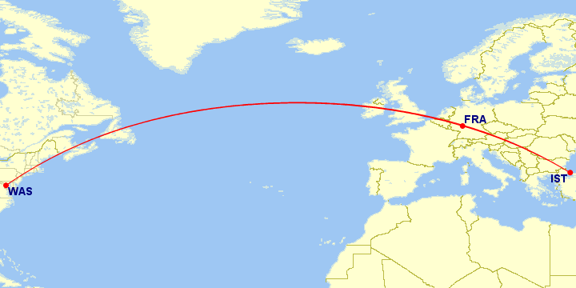
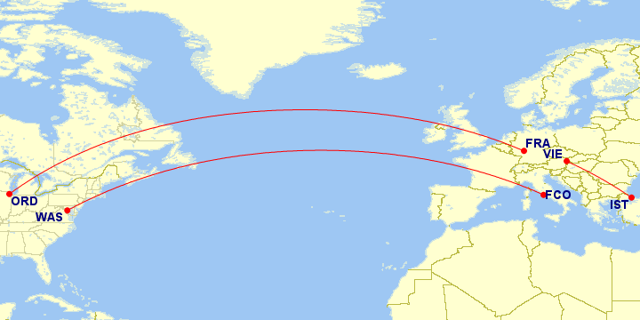

# United Airline
## Summary of Stopover (in United’s words):

* Stopover can not be in your originating region.
* Travel must start and end in the same region.
* Stopovers must be in the same region as the destination.
* You can add more oneways on the same ticket, and they just charge you for the oneway.

## Summary of New United Rules (all in my words):

* One free segment per booking.
	* You’re allowed your free segment as long as your trip ends in the region you started in. 
* Free segment has to be in the same region (but different than the region of origin).
* Booking must return to region of origin.
* 1 stopover per booking and mutliple open-jaws are allowed.
* As many segments are allowed as you want, you just pay for them all like you would a bunch of separately booked oneways.
	* It will price segments one at a time, and it will give you one free segment in a single region.
	* The big reason to book as a multi-city is that you will get a free segment if you have a segment in a single region.
	
## Example to list calculation

```
USA – Europe = 30k
Europe – SE Asia = 55k
SE Asia – USA = 40k
Total = 125k
```

## Stopover examples

### USA - Europe - free segment(stopover) - US

#### WAS – FRA – IST – WAS



```
WAS – FRA = 30k
FRA – IST = 0
IST – WAS = 30k
Total = 60k
```

## Stopover with an open-jaw example

#### ORD – FRA / VIE – IST / FCO – WAS



3 open-jaws and a free segment (or stopover) for 60k! 


```
ORD – FRA = 30k
VIE – IST = 0k
FCO – WAS = 30k
Total = 60k
```

#### ORD – BKK – SIN / MEX – WAS


```
ORD – BKK = 40k
BKK – SIN = 0
MEX – WAS = 17.5k
Total = 57.5k
```

## Multi-Segment & A Stopover

The free segment is always going to be the first segment in a single region different from the region of origin.

In other words, if you kept adding a bunch of segments after, the free segment is going to be the first one within a single region.


### USA – Europe – (free) segment within Europe – SE Asia – segment within SE Asia – USA

#### ORD – VIE – IST – SIN – BKK – ORD


```
ORD – VIE = 30k
VIE – IST = 0
IST – SIN = 55k
SIN – BKK = 17.5k
BKK – ORD = 40k
Total = 142.5k
```

See, technically the free segment is the one that is 1) within a single region and 2) not the region of origin. In this case there are two regions that would qualify for the free segment, VIE-IST and SIN-BKK.

But the key is that the first segment is the free one.

## Multi-Segment /w Open-Jaws & A Stopover
