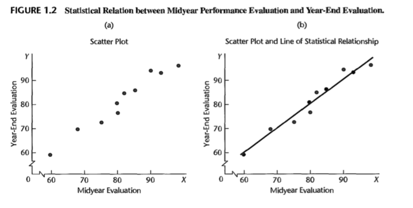
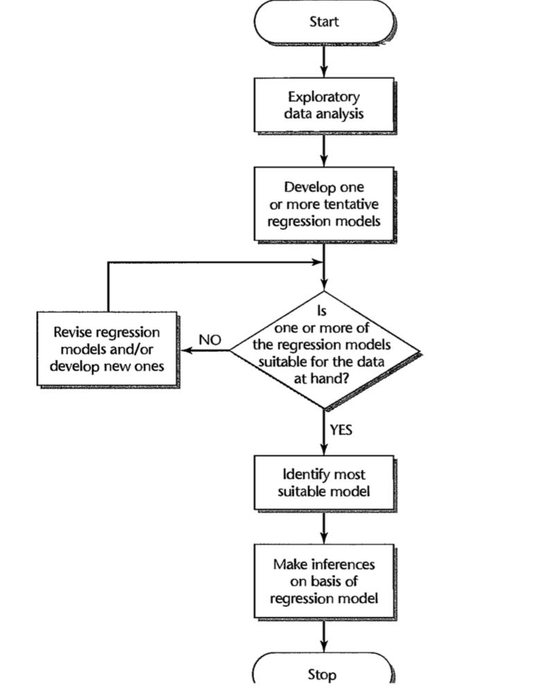

* $X$: the independent variable
* $Y$: the dependent variable

## 1.1 realtions between varaibles 

### functional relation between two variables
Def: **a functional relationship between two variables**: $Y = f(X)$ 

Given a particular value of $X$, the function $f$ indicates the corresponding value of $Y$.

Example: 

* $X$: the number of units sold
* $Y$: dollar sales
* $\$$2: selling price

dollar sales = selling price * the number of units sold

i.e., $Y = 2X$

### statistical relation between two variables

statistical vs functional relation

* statistical relation: not perfect fall directly on the curve of relationship
* functional relation: perfect

The term **regression** describes statistical relations between variables.

### regression models

A regression model is a formal means of expressing the two essential ingredients of a statistical relation:

1. A tendency ofthe response variable Y to vary with the predictor variable X in a systematic fashion.
2. A scattering of points around the curve of statistical relationship.

<b>
These two characteristics are embodied in a regression model by postulating that:

1. There is a probability disfiibution of Y for each level of X.
2. The means of these probability distributions vary in some systematic fashion with X.
</b>

**regression function of Y on X**: the systematic relationship between the means of the probability distribution and the level of $X$

The concept of a probability distribution of Y for any given X is the formal counterpart to the empirical scatter in a statistical relation. 

Similarly, the regression curve, which describes the relation between the means of the probability distributions of Y and the level of X, is the counterpart to the general tendency of Y to vary with X systematically in a statistical relation.

Extension: more than two predictor variables $X_1, \dots, X_2$

A probability distribution of Y for each $(X_1, \dots, X_2)$ combination is assumed by the regression model. 

The systematic relation between the means of these probability distributions and the predictor variables $X_1, \dots, X_2$ is then given by a regression surface.

Example:

At $X = 90$ midyear evaluation, there is a probability distribution.

$Y = 94$ actual year-end evalution is a random selection from the probability distribution.

## Construction of regression models

1. selection of predictor variables

	A central problem in many exploratory studies is therefore that of choosing, for a regression model, a set of predictor variables that is "good" in some sense for the purposes of the analysis.
	
	selection criteria
	
	* a chosen varaible contributes to reducing the remaining variation in Yafter allowance is made for the contributions of other predictor variables that have tentatively been included in the regression model.
	* the degree to which observations on the variable can be obtained more accurately, or quickly, or economically than on competing variables
	* the degree to which the variable can be controlled

2. functional form of regression relation

	 1. The functional form of the regression relation is not known in advance and must be decided upon empirically once the data have been collected.
	 2. If the true functional form is complex, use simple form to approximate, such as, linear, quadratic

	

3. scope of model

	scope is determined by
	
	* the design of the investigation
	* or the range of data at hand

	Example: investigate the effect of price on sales volume investigated six price levels, ranging from $\$4.95$ to $\$6.95$
	
	
	The scope of the model: around $\$5$ to near $\$7$. 
	
	The shape of the regression function substantially outside this range would be in serious doubt because the investigation provided no evidence as to the nature of the statistical relation below $\$4.95$ or above $\$6.95$.

## 3 main purposes for using regression

In practice, the several purposes of regression analysis overlap.

1. description
2. control, e.g. control costs
3. prediction

## Regression and Causality

Regression analysis by itself provides no information about causal patterns and **must be supplemented by additional analyses to obtain insights about causal relations.**

1. **The existence of a statistical relation between the response variable Y and the explanatory or predictor variable X does not imply in any way that Y depends causally on X. No matter how strong is the statistical relation between X and Y**

	Because of confounders
	
2. **Even when a strong statistical relationship reflects causal conditions, the causal condi- tions may act in the opposite direction, from Y to X.** 

## History of regression

Sir Francis Galton @ the latter part of the 19th century

* relationship between heights of parents and children

## Simple Linear Regression Model

* **simple**: only one predictor variable
* **linear**: the regression function is linear

	* linear in the parameters
	* linear in the predictor variable

A model that is linear in the parameters and in the predictor variabie is also called **first-order model**.

### regression model vs regression function

Example

* regression model: $Y_i = 9.5 + 2.1 X_i + \varepsilon$
* regression function: $Y = 9.5 + 2.1 X$

#### regression model 1 (1.1)

$$Y_i = \beta_0+\beta_1X_i+\varepsilon_i$$

where

* $Y_i$: the value of the response variable in the $i$th trial
* $\beta_0$ and $\beta_1$: parameters
* $X_i$: a known constant, i.e. the value of the predictor variable in the $i$th trial
* $\varepsilon$: a random error term with mean $E[\varepsilon] = 0$ and variance $\sigma^2_{\varepsilon_i} = \sigma^2$
	* $\varepsilon_i$ and $\varepsilon_j$ are uncorrelated so that their covariance is 0

		Cov($\varepsilon_i, \varepsilon_j$) = 0 for all $i, j$ and $i \neq j$ 
		
		$i=1,\dots,n$
		
#### regression model 2 (1.5)

$$Y_i = \beta_0X_0+\beta_1X_i+\varepsilon_i$$ where $X_0 \equiv 1$

#### regression model 3 (1.6)
$$Y_i = \beta_0+\beta_1X_i+\varepsilon_i = \beta_0+\beta_1(X_i-\bar{X})+\beta_1\bar{X}+\varepsilon_i=\beta^{*}_0+\beta_1(X_i-\bar{X})+\varepsilon_i$$

$$Y_i= \varepsilon_i=\beta^{*}_0+\beta_1(X_i-\bar{X})+\varepsilon_i$$

$$\beta^{*}_0=\beta_0+\beta_1\bar{X}$$

#### regression function

$$Y = \beta_0+\beta_1X+\varepsilon$$

## Features of regression models

1. $Var(\varepsilon_i) = \sigma^2$ is a **constant**.
2. $\varepsilon_i \stackrel{iid}{\sim} N(0, \sigma^2)$

	**iid**: Independent and identically distributed random variables

	1. the same distribution  => variance is the same
	2. independent
1. The response $Y_i$ in the $i$th trial is the sum of two components

	1. **the constant term $\beta_0+\beta_1X_i$**
	2. the random term $\varepsilon_i$

2. From (1), $Y_i$ is a random variable.
3. **$Y_i \stackrel{iid}{\sim} N(\beta_0+\beta_1X_i, \sigma^2)$** and all $Y_i$ has the same distribution.

	* $Y_i$ has the same distribution
	* $Y_i$ and $Y_j$ are independent, i.e., not correlated

	proof: 
	
	Mean of $Y_i$ in the $i$th trial = $E(Y_i) = E(\beta_0+\beta_1X_i+\varepsilon_i) = \beta_0+\beta_1X_i + E(\varepsilon_i) = \beta_0+\beta_1X_i$
	
	Variance of $Y_i$ in the $i$th trial = $Var(Y_i) = Var(\beta_0+\beta_1X_i+\varepsilon_i) = Var(\varepsilon_i) = \sigma^2 (constant)$ 
 

1. The regression function is $E[Y] = \beta_0+\beta_1X$

	**Because the regression functions relates the means of the probability distribution of $Y$ for given $X$ to the level of $X$**
	

## Meaning of Regression Parameters

definition

* $regression coefficients$: the parameters $\beta_0$ and $\beta_1$
* **slope** of the regression line: $\beta_1$
	* indicate the change in the mean of the probability distribution of $Y$ per unit increase in $X$

## Estimation of parameters

The observational or experimental data to be used for estimating the parameters of the regression function consist of observations on the explanatory or predictor variable X and the corresponding observations on the response variable Y. For each trial, there is an X observation and a Y observation. We denote the (X, Y) observations for the first trial as ($X_1$, $Y_1$), for the second trial as ($X_2$, $Y_2$), and in general for the ith trial as ($X_i$, $Y_i$), where i = 1, ... ,n.

### Method of least-Squares

the deviation of $Y_i$ from its expected value: $Y_i - (\beta_0 + \beta_1X_i)$

the sum of the $n$ squared deviations: $Q=Y_i - \sum\limits_{i=1}^n(\beta_0 + \beta_1X_i)^2$

the estimators of $\beta_0$ and $\beta_1$ are those values that minimize the criterion Q for the given sample observations $(X_1$, $Y_1),(X_2$, $Y_2),..., (X_n$, $Y_n)$