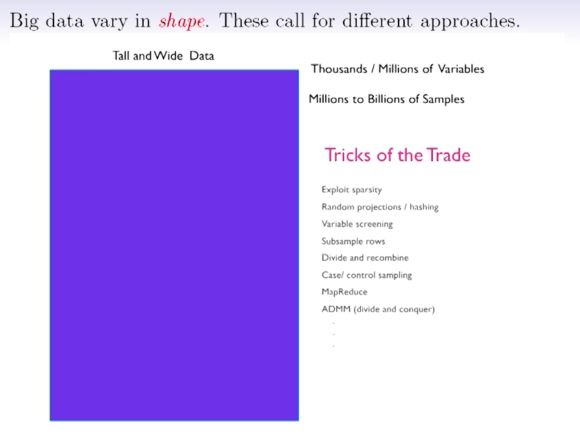
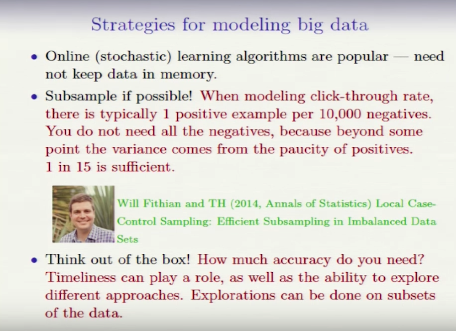
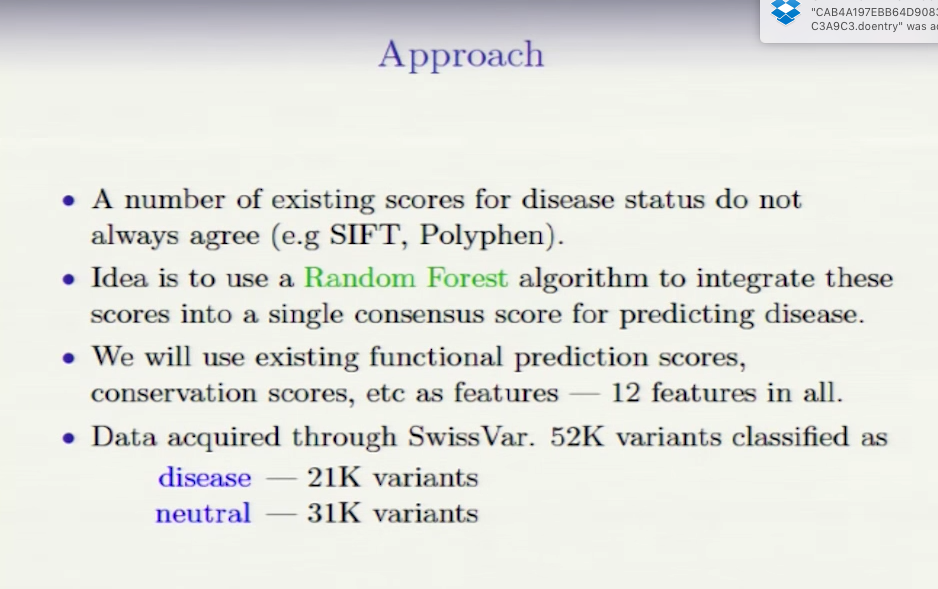
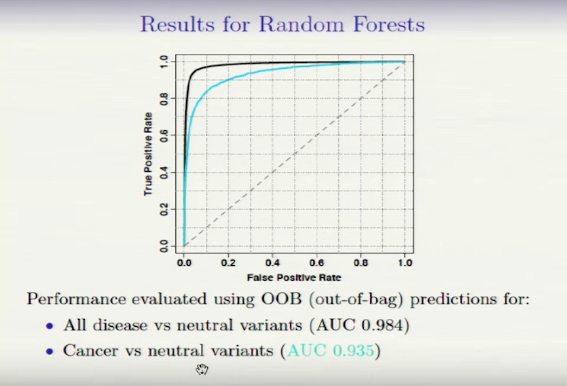
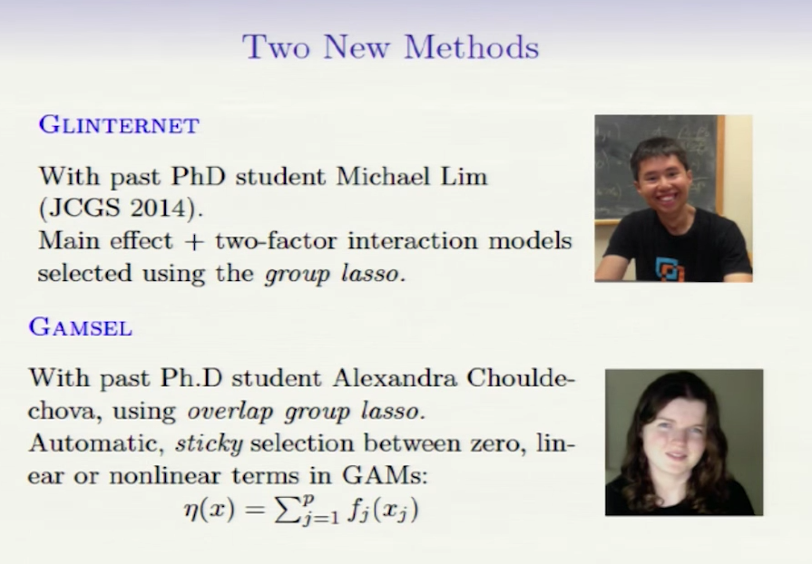

* some definition

	* machine learning: construct algorithms that can learn from data
	* statistical learning: a branch of applied statistics that emerged in response to machine learning, emphasizing statistical models and assessment of uncertainty
	* data science: the extraction of knowledge from data, using ideas from mathematics, statistics, machine learning, computer science, engineering, ...

	**All of these are very similar with different emphases**

	* applied statistics

	
### big data vary in shape. 

* wide data: p>>n

	thousands/millions of variables

	hundred of samples
	
	* screening and fdr
	* Lasso
	* SVM
	* stepwise

* tall data: n>>p

	tens/hundres of variables

	thousands / millions of samples
	
	* GLM
	* random forests
	* boosting
	* deep learning

	harvey的project不适合用random forest?
	
	
	
	
	
	
* ways to deal with big data

	* split m parts

		fit for each part
		
		average result
		

