# 古代女子发式

<http://tieba.baidu.com/p/1196126250>

发式是妇女头部的重要装饰，能增加其仪容的俊美。

历代相承，不断变化，从简至繁，，又从繁复简，往返交替，有关记载甚多，仅就《髻鬟品》记载就不下百余种。

这些发名皆是由发型与首饰寓意而命名，绰号虽多，按其编法与发式可概括为几种基本类型

* 蝉鬓、博鬓: 不是发型，但是各种发型必需配备的两种鬓式。 
	* 蝉鬓
		* 创作者: 据记载 魏文帝曹丕的宫人莫琼树所
		* 是两鬓的装饰: 将两鬓梳得很薄而透明，形如蝉翼，故称“蝉鬓’
		* 古诗中形容妇女经常有“云鬟雾鬓”之句，薄而透明的蝉鬓与厚而高实的发式结合与对比，使妇女的发型富于变化而别致
	* 博鬓
		* 历代僻《仪典》，《舆服志》皆规定宫中的后妃要博鬓，品贵夫人也须博鬓，博鬓即以鬓掩耳，或往后拢掩半耳，是一种礼仪的鬓式。 

妇女最常见的发型

* 按其梳编规律分为6大类
* 造型(手法)
	* 髻
	* 鬟
	* 盘
	* 绾
	* 叠
	* 拧
	* 结
	* 等等
* 根据朝代、身分、年龄，个性崇好等结合而运用，就能创制较好的妇女发式。

## 1. 结鬟式 

这类发型，皆是结鬟而成

做法:
	
1. 把发拢结于顶
2. 分股用丝绳系结
3. 弯曲成鬟
4. 托以支柱，高耸在头顶或两侧，或平展，或垂挂

妇女自身头发有限，往往加上‘假发”，首饰
	
历史: 
	
相传汉武帝时，瑶池王母来会，诸仙女之发髻皆异人间，高环巍峨，帝令官妃仿效，因此号为“高鬟望仙髻”，再饰有各种珠宝，金簪风钗或步摇，就更华丽高贵。

这种高环发型有一至九鬟，是最尊贵的发式，多用来表示神话中之仙女，皇后贵妃与贵女流的发型。未出室的少女也可采用，但装饰不宜过分华丽，这种发式秦汉两代及秦以前各代颇为盛行，汉以后各代多崇为仙女发型，名流仕女也有采用。 

　　其形式有高鬟，有平鬟，有垂鬟，有在头顶，有在两侧，鬟数也可随意结扎而定，变化很多，可灵活运用。
　　
### 1.1 飞仙髻、凌云髻

飞仙髻多是两侧结高鬟。始见于汉代，其式绾发于顶，呈飞动状。据《炙毂子》记载：“汉武帝时，王母降，诸仙髻皆异人间，帝令宫中效之，号飞仙髻。”多用于仙女与未出室少女。 

凌云髻属于高式的单鬟。常见与唐代。据《中华古今注》记载：“始皇诏后梳凌云髻，三妃梳望仙九鬟髻，九嫔梳参鸾髻。”

### 1.2 飞天髻，垂鬟分肖髻

飞天髻，又叫“飞天紒”。是一种三环高髻，始于南北朝。《宋书·五行志》：“宋文帝元嘉六年（429），民间妇人结发者，三分发抽其髻直向上，谓之‘飞天紒’，始自东府，流被民庶。”其形是先将头发分三分，每分用丝绦缚住，向上盘卷成环状。出自宋文帝宫中，传至民间，后一直流行于宋、明各朝。古之“百花”发式亦属这种类型。 

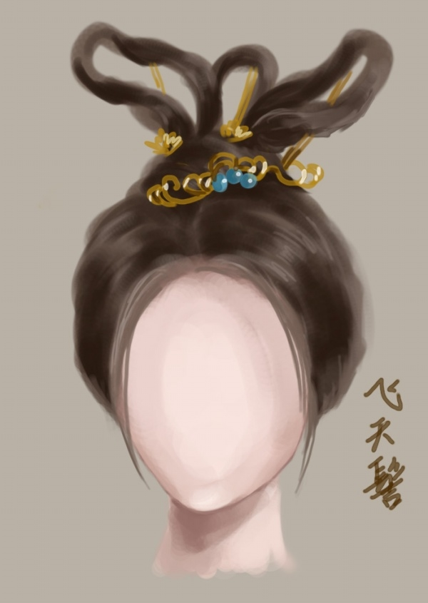

垂鬟分肖髻，多是未出室少女的发式，将发分股，结鬟于顶，不用托拄，使其自然垂下，并束结肖尾、垂于肩上，亦称燕尾。据《国宪家猷》记载：“汉明帝令宫人梳百花分肖髻。”在唐代常作为处女发式标志。

## 2.拧旋式

拧旋式梳编法，是将发分几股，似拧麻花地把发蟠曲扭转，盘结于头顶或两侧。据《采兰杂志》记载：“甄后既入魏宫，宫庭有一绿蛇，口中恒吐赤珠，若梧子大，不伤人，人欲害之。则不见矣。每日后梳妆，则盘结一髻形于后前，后异之，因效而为髻，巧夺天工，故后髻每日不同，号为灵蛇髻，宫人拟之，十不得一二也。”
　　
　　

### 2.1 随云髻、凌虚髻
“随云髻”类似侧拧之形式，其髻如随云卷动。据《国宪家猷》记载：“陈宫梳随云髻。”这种发式生动灵转，颇为仕女所好。

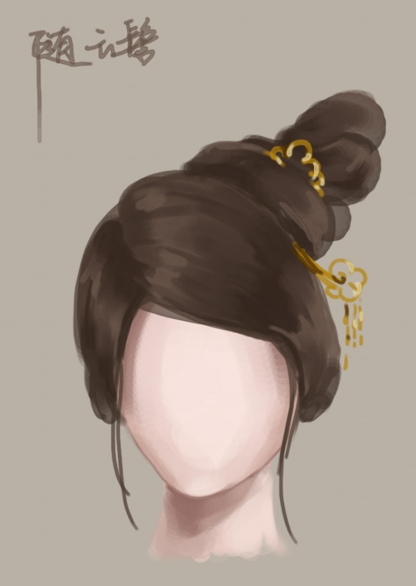

“凌虚髻”属于交拧的形式，其髻交集拧旋，悬空托在顶上。据《中华古今注》记载：“隋有凌虚髻、祥云髻。”这种发式如云盘回，凌托顶上，摇而不脱落。

### 2.2 朝云近香髻、回心髻

“朝云近香髻”类似叠拧的形式，其编法是将发分股拧盘，交叠于顶，生动而稳定。据《中华古今注》记载：“大业中令宫

回心髻类似盘拧的形式，其编法是将发分股交拧，盘结回心于头顶或头前。据《中华古今注》记载：“梁武帝诏宫人梳回心髻。”清佚名之《胤祯妃行乐图屏》中亦有这种发式。

## 3. 盘叠式 

盘叠式梳编法是将头发用丝线分股拢结系起，然后采用编、盘、叠等手法，把发髻盘叠成螺状，放置在头顶或两侧或前额与脑后，称为“螺髻”。在《凝宫词》里有“螺髻凝香晓黛浓”之句，这种发式在唐代兴起流行，从存世的唐代绘画、墓壁画中皆可见到。永泰公主及墓壁画及八十七神仙图卷中之仙女，皆类似这种发式。据记载；唐长安的妇女好梳盘桓髻(即螺髻)．回，其形高耸而不走落，号为螺髻。在长安风靡一时。这种发型秀丽而富有装饰性，为后妃公主、贵妇所好，其变化形式甚多，一般有单螺、双螺、百合髻、盘恒髻等形式。
　　这种发型秀丽而富有装饰性，在王渔洋之诗赞有“青螺如髻秀堪餐”，按盘叠之方法，可作出各式各样的螺謦。在造型中可灵活运用。

### 3.1 单螺、双螺

单螺其梳编法是将发股集结，盘叠如螺，置于头顶上。在永泰公主墓石椁内西面北次间之雕饰，亦有些类发式。
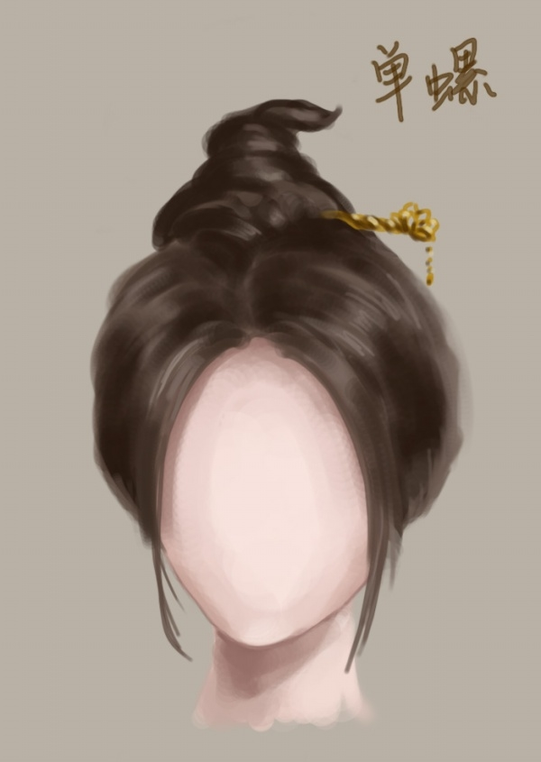

双螺其梳编法是将发分为两大股，盘结双叠于两顶角，亦名“双角”。在《喀喇和卓古墓壁画》亦有这类发型，螺髻清晰秀雅。

### 3.2 百合髻、盘桓髻

“百合髻”其梳编法是净发分股盘结，并合叠于头顶。

“盘桓髻”其梳编法是将发蟠曲交卷，盘叠于头顶上，稳而不走落，称为盘桓髻。据《中华古今注》记载：“长安妇女好为盘桓髻，到今其法不绝。”

没图

## 4. 结椎式 
　　结椎式的梳编法是将头发拢结在头顶或头侧，或前额与脑后，在扎束后挽结成椎，用簪或钗贯住，可盘卷成一椎、二椎至三椎，使之耸竖于头顶或两侧。据《事物原始》记载：“孙寿为堕马髻，赵合德入宫卷发，号新兴髻，孟光为椎髻。”皆类似于结椎式，结椎式蕴藉持重，温文尔雅。这类发式在古代妇女的发型中，最为普遍，采用最广，历代都有采用，延续最长，从商周、秦汉、隋唐、宋、元、明、清等历代皆沿用。只是发型的高、平，低，及结椎在前、中、左右、后等变化不同而已。各式椎髻多为已婚少妇所用。主要有高椎髻，抛家髻、堕马髻等几大类。
　　
### 4.1 高椎髻、抛家髻

“高椎髻”其梳编法是将发拢结于顶，挽成单椎，耸立于头顶，据《妆台记》记载：“宋理宗朝宫妃梳高髻于顶，巍峨高耸，号高椎髻。”在宋代山西太原晋祠女塑中亦有这种发式。

抛家髻，唐末京师妇女梳发，以两鬓抱面，状如椎髻，名曰“抛家髻”，亦称“鬅鬓”，“凤头”。这种两鬓抱面的髻式，是唐代后期较为流行的一种发式。其梳编法是在头顶挽椎成髻，两鬓缓长，以泽胶贴而抱面。据《唐五行志》记载“贵妃假鬓为首饰，曰义髻，僖宗内人束发甚急为囚髻，唐末妇人梳发以两髻抱面为抛家髻”。今京剧旦角仍延用之。 

### 4.2 倾髻、堕马髻
倾髻其梳编法是将发分股结椎、倾斜结束置于头前或头侧，在仕女画中颇为多见。据《晋书》记载：“太元中公主妇女必缓鬓，倾髻以为盛饰。” 

堕马髻，是中国魏晋时期妇女的一种发型，亦名“倭堕髻”。其梳编法是将发拢结，挽结成大椎，在椎中处结丝绳，状如马肚，堕于头侧或脑后。堕马髻据说是东汉权臣梁冀的妻子孙寿发明的。《后汉书·梁冀传》：“寿色美而善为妖态，作愁眉、啼妆(妆)、堕马髻，折腰步，龋齿笑。”《古今中华注》也记有“堕马髻惟倭堕髻，一云：堕马之余形也”。

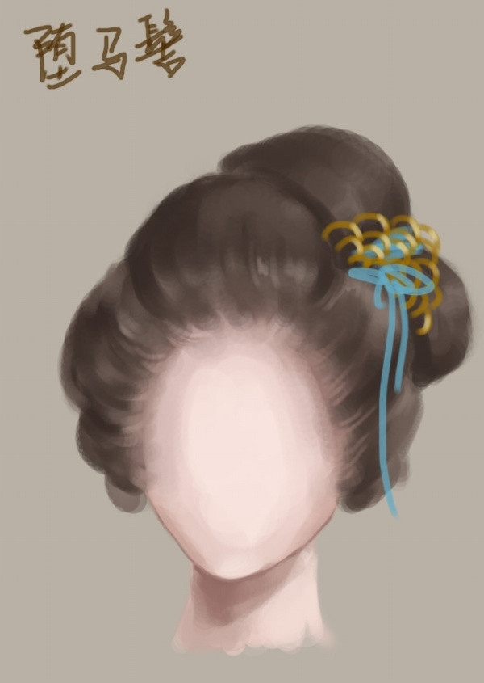

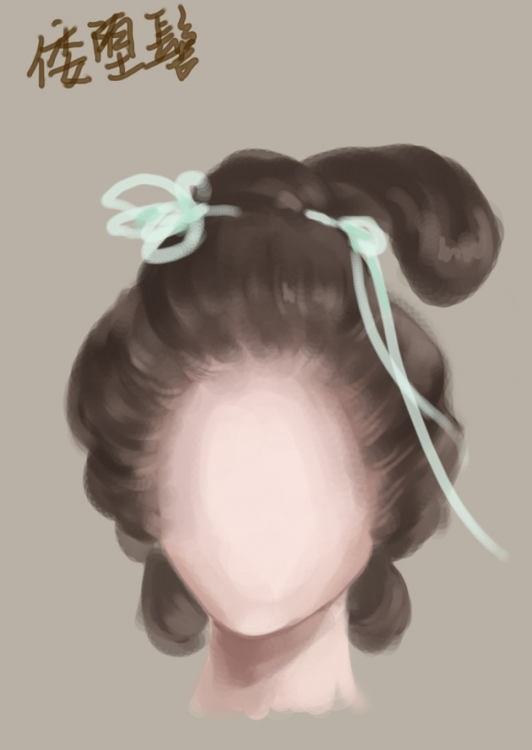

## 5 反绾式 
　　反绾式的梳编法是将头发往后拢结，用丝线结扎，再分若干股，翻绾出各种式样。据《妆台记》记载：“唐武德中梳半翻髻，反绾髻，分髫髻……开元中梳反绾髻、回鹤髻，贵妃作愁来髻，贞元中归真髻，贴五色花子。”这种反绾梳编较难，多流行于盛唐。其变化一般有“双刀髻”、“惊鹄髻”、“朝天髻”、“元宝髻”等。 
　　这种发型多为宫妃、名贵女流所好用，未出室的少女常在反绾的髻下留一发尾，使之垂在肩后，称为“燕尾，亦称“分髫髻”。历代的称呼虽不相同，但其基本发式是相似的，在造型时，可灵活变化与参考。

### 5.1 双刀髻、惊鹄髻

双刀髻其梳编法是将发往上拢结于顶，再反绾成双刀欲展之势。流行于初唐宫中，后传于贵族妇女中，士庶女子少见。据《妆台记》记载：“唐武德中，宫中梳半翻髻。又梳反绾髻，贞元中梳归真髻，贴五色花子。”皆类似反绾式的发型。

“惊鹄髻”也是反绾式之一。其梳编法是将发拢上反绾，成惊鸟双翼欲展之势，生动而有趣。据《中华古今注》记载：“魏宫人好画长眉，令作蛾眉，惊鹄髻”。 据传此髻始于魏文帝宫中，后传入士庶间，到了唐代，风靡于长安城中。

### 5.2 朝天髻、元宝髻

朝天髻，五代后蜀时发髻名。也属反绾式之一，其编法将发拢上，束结于顶。再反绾成高髻朝天。《宋史·五行志·木》：“建隆初，蜀孟昶末年，妇女竞治发为高髻，号朝天髻。”宋代所建的太原晋祠女像，亦类似这种发型。 

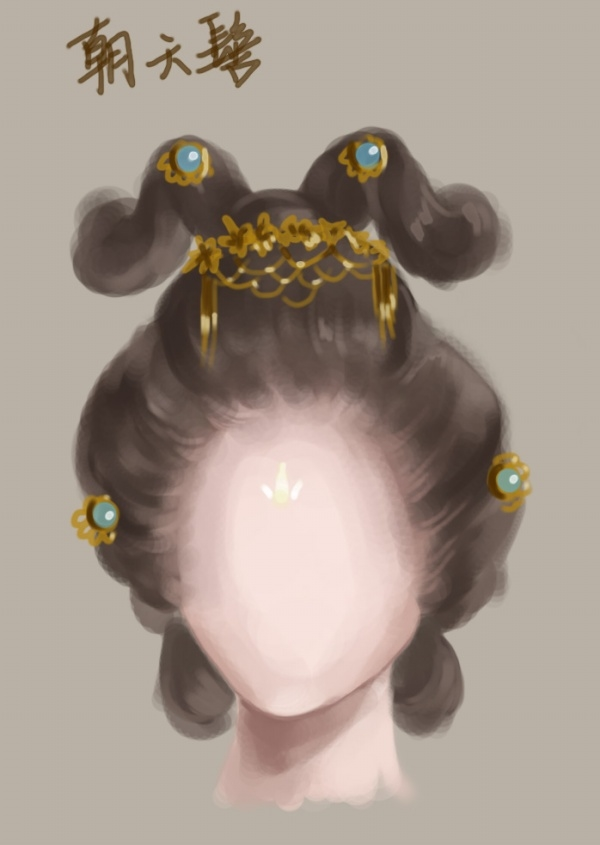

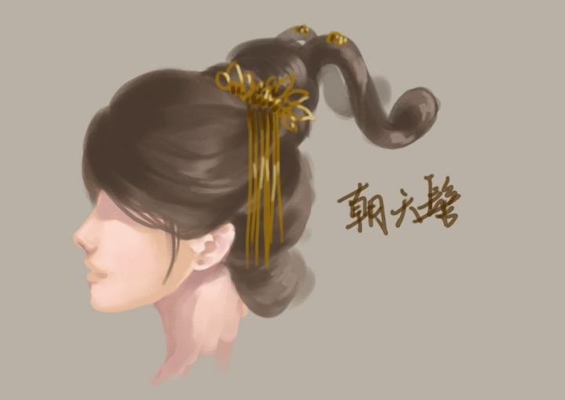

元宝髻其梳编法是将发拢结于顶，再置木或将假发笼蔽，呈元宝状。据〈晋书〉记载：“用发既多，不可恒载，乃先木及笼上装之，曰假髻或假头。”唐张雄夫妇合葬墓所出土之女俑亦类似这种发型。

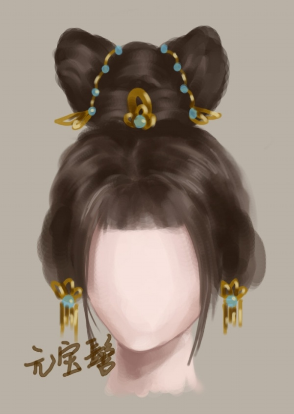

## 6.双挂式 
　　双挂式之梳编法，是将发顶平分两大股，梳结成对称的髻或环，相对垂挂于两侧。这种发式多用于宫廷侍女、丫环侍婢或未成年之少女。据记载从秦开始，延续及近代，其中最典型的是双丫髻及双挂髻，这种发式在存世的古画中特别多见。敦煌千佛洞供养人之侍女与阎立本《列帝图》之宫侍，皆类似这种发式。其变化一般有“双丫髻”、“垂挂髻”、“双平髻”等。

### 6.1 双丫髻、垂挂髻

双丫髻是双挂式中最常见之发式，其梳编法是将发平分两侧，再梳结成髻，置于头顶两侧。前额外负担多饰有垂发，俗称刘海，一般多用于侍婢丫环。 

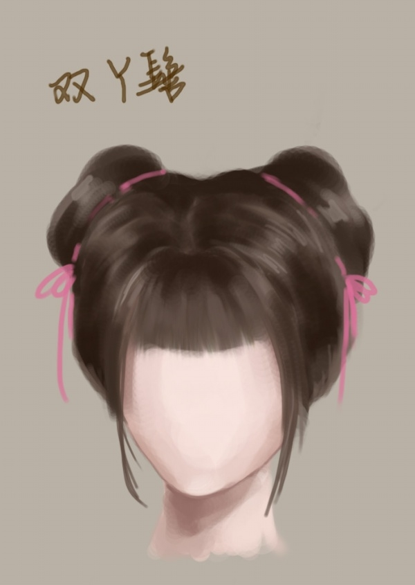

垂挂髻其梳编法是将发从头顶平分两股。结成髻或鬟，垂挂于两侧，额前饰有垂发。据〈丹铅录〉记载：“北齐后宫之服，女官八品、偏垂发。（注云：垂发，覆目也，盖夷中少女之饰，其四垂短发仅覆眉目，而顶心长发，绕为卧髻，宋人词所谓鬓垂偏荷叶也。今世犹有之”）亦类似这种发式。 

### 6.2 双平髻 丱发

双平鬟属于双挂式之梳编法，其梳编法是将发平分于两侧。再束结成环，使其对称而自平垂。挂于两侧。这种发式在仕女图中颇为多见，多用于未婚少女或儿童。 

丱(guàn)发，其形似“丱”字，故名。为儿童或未婚少女之发式，其梳编法是将发平分两股，对称系结成两大椎，分置于头顶两侧，并在髻中引出一小绺头发。使其自然垂下，最长可至肩，为历代童发的主要发型。

## 还有两个不知道放在哪个类别里面的，就单放了出来

　　牡丹头：高髻的一种，苏州流行此式，后逐渐传到北方。尤侗诗：“闻说江南高一尺，六宫争学牡丹头。”人说其重者几至不能举首，形容其发式高大，实际约七寸，鬓蓬松而髻光润，髻后施双绺发尾。这种髻当系假发衬垫，加以黏汁光润之。
　　
　　
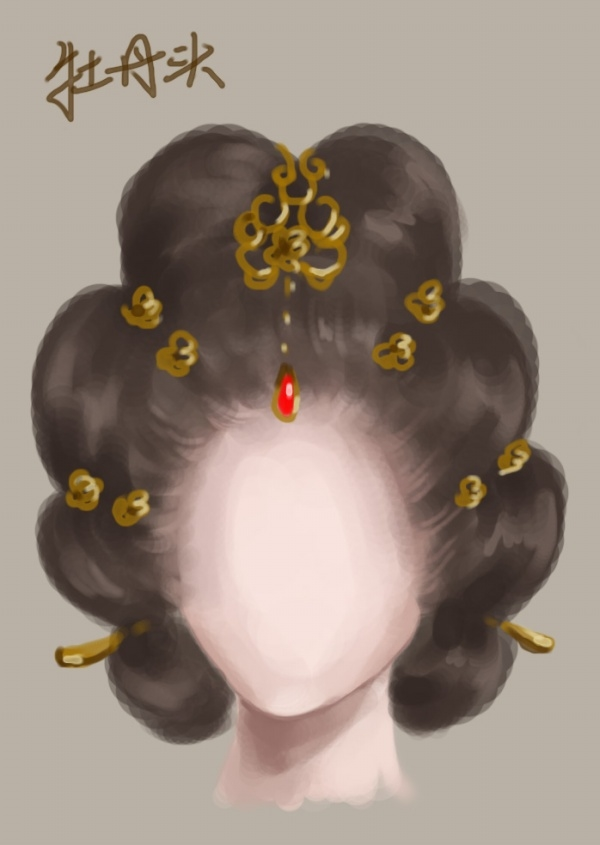

十字髻：因其发髻呈“十”字形而得名的一种髻式。流行于魏晋南北朝时期，魏晋之后各朝均很少见。这种发式的编盘方法是：先将头发盘成一个“十”字行的发髻，再将余发在头的两侧各盘一鬟直垂至肩，上用簪、钗固定即可。

# 古代的头饰

## 凤冠

为古代后妃及诰命夫人之礼冠，冠上饰以凤鸾，真珠玉翠，多于大礼时戴用。明制，皇后礼服的冠饰有九龙四凤。明神宗定陵出土了四顶凤冠，龙凤数目各不相同。其中一顶为六龙三凤，龙在顶两端，口衔长串珠滴，似有戏凤之意。正面有三只展翅凤凰。冠后下方有左右各三扇博鬓，展开后如同五彩缤纷的凤尾。
　　皇妃、公主、太子妃的凤冠九翚四风。翚是有五彩的雉。一品至七品命妇的凤冠没有凤，绣有不同数量的雉。

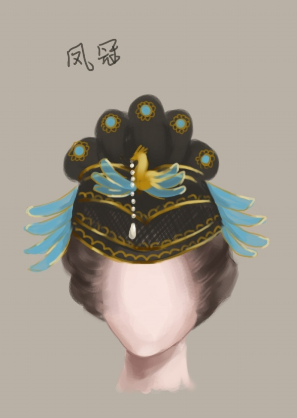

## 莲花冠

因其形似莲花，故名。唐时已在士遮女子间流行，宋沿其制。冠上大多用金、翠羽等作装饰，颜色鲜艳，为官宦、士庶女子喜尚，一直很流行。

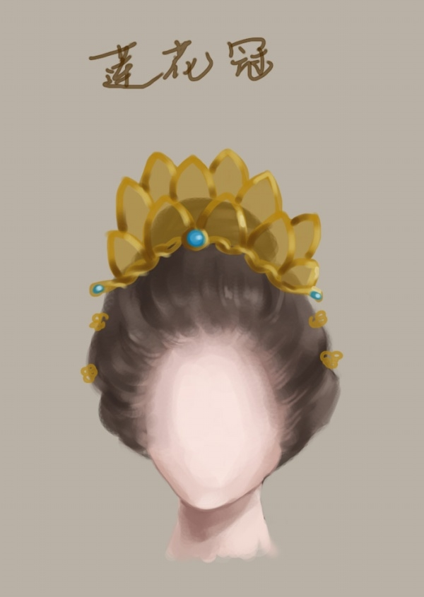

## 花冠

冠小仅束髻，冠上多有花饰，在明代仕女多好用

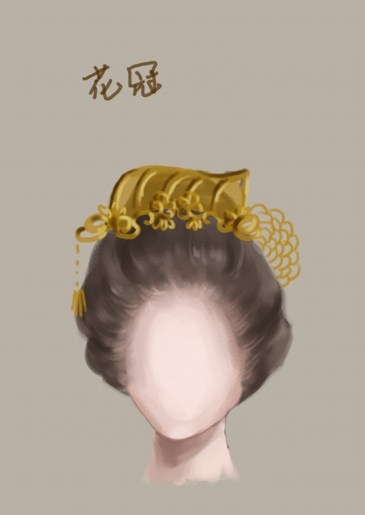

古时候的贵族妇女，常在举行祭祀大典时戴一种用丝织品或发丝制成的头饰，这种头巾式的头饰叫巾帼，其上还装缀着一些金珠玉翠制成的珍贵首饰。因巾帼这类物品是古代妇女的高贵装饰，人们便称女中豪杰为“巾帼英雄”，后人又把“巾帼”作为妇女的尊称

## 巾帼

# 清朝的发式
## 小两把头

清朝上层贵族妇女长期占统治地位的发型。清初，健全冠服制度。除大典礼时后妃戴朝冠外，喜庆节日后妃要戴钿子。戴上钿子，脑后再垂发辨就不适应了。于是，后妃们梳两个横长髻,形似小姑娘梳的两个抓髻，戴上钿子十分稳固。摘下钿子，这种抓髻式的发髻也可作家常打扮。因为这种发式，平分左右，各扎一把，宫内后妃称其为“小两把头”。

## 两把头
清中期，是史称乾隆盛世的黄金时代。在此期间，生产方式和生活方式有很大的发展，首饰制作工艺也不例外。清代宫廷处在特殊的位置上，全国各地的名贵首饰源源不断地贡进清宫，大大刺激了宫廷后妃追求美饰的心理。但是，要这些份量可观的金、银、玉、珍珠、宝石的首饰戴在头上，“小两把头”发髻就显出许多不足之处。如“小两把头”低垂，几乎挨到耳根，发髻松，稍碰即散。如何将这些美丽的首饰戴上去呢？于是，一种新的梳头工具——发架应运而生。发架有木制的，也有铁丝拧成的，形似横着的眼镜架。梳头时，先固定头座，再放上发架，把头发分成左右两把，交叉绾在发架上。中间横插一长扁方（插在发架的两个孔内），然后用针把发稍和碎发固定牢，戴什么样的首饰都捉得住。两把头后面的耳边的垂发，梳成扁平状，末端用发带束起，微微上翘，形似燕尾。整个发髻象个待飞的燕子，清代后妃还因年龄而异梳头戴首饰。年纪轻的，戴艳丽的珍宝首饰，显出年青活泼的朝气。年老的梳“两把头”，首饰选质地高贵的，体现出老年妇女端庄、稳重。皇家女子头上梳两把头，插戴上贵重的首饰，与脚下穿着高底鞋相呼应。走起路来上身直立挺胸收腹，似有节奏，头节、脖梗不能左右摇晃，来回摆动。为封建社会树立了妇女行动规范的最佳形象。 

## 架子头

随着满族妇女发式的不断复杂化，其头式也逐渐的多了起来。架子头发式便是由两把头发展而来，因在髻中衬有架子取其形似，故称“架子头”。梳妆时先将头发梳成两个横长髻，即将整个头发平分为左、右各～把，形似小姑娘梳的两个抓髻。再以铁丝或藤条做成骨架，外边缠上青绸、缎绒，形似簸箕的钿子戴在头上，再用两条黑缎带系于颌下，使钿子可以十分稳固的戴在头上这种“架子头”是满族妇女出席隆重场合时的盛装。

## 一字头
一字头，豪华奢侈，高如牌楼，皇室偏爱的大拉翅即是其中最著名的一支。和大拉翅差不多。只不过这个没有冠。

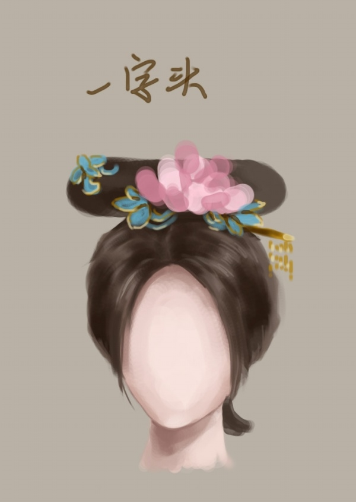

## 大拉翅
到了清朝晚期，大拉翅开始出现，它是一形似扇面的硬壳，高约一尺余，里面用铁丝按照头围大小做一圆箍和骨架，再用布裕褙做胎。外边包上青缎和青绒布，做成一个固定的纯装饰性大两把头。需用时，戴在头上，不用时，摘下搁置一边。既能美饰头发，又摘戴自如，可谓两全其美。发明者是追求的美丽的慈禧太后，世人的审美因她而改变，随着大拉翅的流行和演变，两把头开始退出历史舞台。

## 圆髻、燕尾

燕尾属一种脑后发式，梳头时将脑后余发分开，梳成两个尖角燕尾形扁发髻垂于脑后，故称“燕尾发”。满族发式多在脑后留燕尾。

　这个应该是大拉翅下面的发髻
